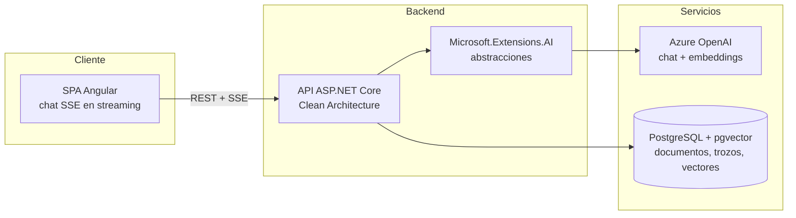

[English](README.md) · **Español**

# DocuMind

Conversa con tus documentos — un asistente de conocimiento basado en RAG que responde preguntas sobre tus PDF citando la página exacta.


## Por qué este proyecto

La mayoría de los chatbots documentales responden con seguridad pero no pueden decirte *de dónde* salió la respuesta. DocuMind está construido alrededor de una generación aumentada por recuperación verificable: cada respuesta se fundamenta en los documentos subidos y cita la página exacta de la que proviene, de modo que el usuario siempre puede comprobar la fuente.

- Sube PDF y pregunta en lenguaje natural.
- Respuestas de chat en streaming (SSE) con citas en línea como `[informe.pdf, p. 12]`.
- Backend con Clean Architecture, diseñado para ser agnóstico del proveedor y testeable.

## Estado del proyecto

La Fase 1 (MVP) está terminada, construida como dos rebanadas verticales:

- **Rebanada A — Ingesta (terminada, verificada en CI):** subida de PDF → extracción de texto por página (PdfPig) → troceado de tamaño fijo (~800 tokens, 15 % de solapamiento, conservando el número de página) → embeddings de Azure OpenAI vía `Microsoft.Extensions.AI` → persistencia en PostgreSQL/pgvector. Incluye la migración inicial de EF Core (extensión vector + índice HNSW), validación de la petición (PDF inválido → 400, límite de tamaño de subida, aviso de texto vacío) y pruebas unitarias.
- **Rebanada B — Chat + UI (terminada, verificada con una demo):** recuperación top-k entre documentos ordenada por distancia coseno de pgvector, un endpoint `/api/chat` en streaming SSE con citas obtenidas de los metadatos de los trozos recuperados, y una interfaz Angular mínima de subida y chat. El número de trozos recuperados (`Retrieval:TopK`, 5 por defecto) es una opción configurable y no secreta. El pipeline del cliente de Azure OpenAI recibe una política de reintento explícita (5 intentos, backoff exponencial, respeta `Retry-After`) para que una llamada de chat limitada por cuota (429) se reintente en lugar de mostrarse al usuario — la cuota del despliegue de chat es deliberadamente estrecha por control de costes, así que los 429 son un caso esperado bajo carga real, no un caso extremo.
- **Siguiente en la Fase 1**: una rebanada de diseño dedicada para la interfaz Angular — la actual es funcional pero deliberadamente sin estilo.

Una pasada de endurecimiento sobre la Rebanada A movió la configuración de Azure OpenAI detrás de `dotnet user-secrets`, dejó fijada una vulnerabilidad transitiva de severidad alta en la cadena de dependencias de OpenAPI, hizo explícita la postura anti-forgery del endpoint de subida no autenticado y dio un nombre fijo al stack de Compose. `dotnet build` y `dotnet test` están limpios: 0 avisos, 0 errores, 14/14 pruebas pasando.

## Arquitectura



## Stack tecnológico

| Capa | Tecnología |
| --- | --- |
| Frontend | Angular (componentes standalone, SCSS, chat SSE en streaming) |
| Backend | ASP.NET Core sobre .NET 10 (C# 14), Clean Architecture |
| IA | Azure OpenAI mediante las abstracciones de Microsoft.Extensions.AI |
| Almacén vectorial | PostgreSQL + pgvector |
| Entorno de desarrollo | Docker Compose |
| CI/CD | GitHub Actions (build + test en cada push) |

## Decisiones clave y su motivo

- **Azure OpenAI detrás de Microsoft.Extensions.AI** — la aplicación depende de las abstracciones `IChatClient` / `IEmbeddingGenerator`, no de un proveedor concreto. Cambiar Azure OpenAI por OpenAI, Ollama o cualquier otro proveedor es una modificación en la raíz de composición, no una reescritura.
- **pgvector sobre PostgreSQL** — una sola base de datos para los datos de negocio y los vectores. No hay un servicio vectorial adicional que ejecutar, respaldar o mantener consistente; los metadatos relacionales y los embeddings conviven y pueden unirse en una única consulta.
- **Troceado de tamaño fijo (~800 tokens, 15 % de solapamiento) con metadatos de página** — cada trozo lleva el número de página de origen, que es lo que hace posible la cita exacta. El solapamiento protege frente a respuestas partidas entre dos trozos.
- **Restauración limitada a nuget.org** — un `NuGet.config` en la raíz del repositorio limpia las fuentes heredadas y restaura únicamente desde el feed público de nuget.org, de modo que un clon nuevo compila igual en cualquier sitio y no puede traer por accidente un paquete interno o suplantado. (El identificador oficial de PdfPig es `PdfPig`, no `UglyToad.PdfPig`.)
- **Vulnerabilidades transitivas fijadas en el nivel superior** — `Microsoft.AspNetCore.OpenApi` 10.0.x declara un suelo exacto de `Microsoft.OpenApi` 2.0.0, y la resolución por versión mínima aplicable de NuGet selecciona precisamente esa versión, que arrastra una vulnerabilidad de severidad alta (GHSA-v5pm-xwqc-g5wc). Ninguna versión de la línea 10.0.x eleva ese suelo, así que actualizar el paquete padre no lo arregla; en su lugar se fija explícitamente la versión parcheada, comentada con el identificador del aviso para poder retirar la fijación cuando el proveedor avance. El mismo enfoque se aplica a `Microsoft.EntityFrameworkCore.Relational` y `Microsoft.Bcl.Memory`. La compilación se mantiene con cero avisos para que un aviso nuevo se vea el día que aparezca, en lugar de perderse entre el ruido.
- **La recuperación DEBE ordenar por distancia coseno, no por "una" distancia cualquiera** — el índice HNSW se declara con la clase de operadores `vector_cosine_ops`, y PostgreSQL solo usa un índice cuando el operador de distancia de la consulta coincide exactamente con la clase de operadores del índice. `EfChunkRepository` ordena con `CosineDistance` de `Pgvector.EntityFrameworkCore`, que se traduce al operador `<=>` (confirmado inspeccionando el SQL generado: `ORDER BY d."Embedding" <=> @queryVector`). Ordenar con `L2Distance` (`<->`) en su lugar compilaría, se ejecutaría y devolvería resultados de apariencia razonable, pero PostgreSQL recurriría en silencio a un escaneo secuencial completo en cada consulta — sin error, sin aviso, solo una consulta mucho más lenta a medida que crece la tabla. Con los volúmenes de fila pequeños de esta demo, PostgreSQL prefiere correctamente un escaneo secuencial de todos modos; ese es el comportamiento esperado del planificador, no una señal de que el índice esté roto.
- **Los reintentos de Azure OpenAI son explícitos en la raíz de composición** — los clientes basados en `System.ClientModel` (como `AzureOpenAIClient`) ya usan por defecto una `ClientRetryPolicy` con backoff exponencial y jitter que respeta la cabecera `Retry-After`, pero ese valor por defecto es fácil de pasar por alto y se limita a 3 intentos. El `DependencyInjection` de `DocuMind.Infrastructure` construye la política de reintento de forma explícita (5 intentos) para que el comportamiento frente a 429 sea visible en el código en lugar de asumido, y fácil de ajustar. Esto importa especialmente aquí: la cuota de tokens por minuto del despliegue de chat es deliberadamente estrecha por control de costes, así que los 429 son una condición esperada bajo carga, no un caso extremo.
- **La URL base de la API es un entorno de Angular, no una constante fija** — `ChatService` lee `environment.apiBaseUrl`. El `fileReplacements` de la configuración de compilación `development` sustituye `environment.ts` por `environment.development.ts` (`http://localhost:5092`, el puerto local de la API); el `environment.ts` por defecto que usa producción entrega `''` a propósito — una base vacía hace que cada petición se resuelva contra el propio origen de la página, lo correcto en cuanto la API es alcanzable desde el mismo origen que el cliente o a través de un proxy inverso, y no es un valor que alguien olvidó rellenar.
- **Ninguna credencial literal en configuración versionada** — `appsettings.json` contiene solo topología de despliegue no secreta (los nombres de los despliegues de modelo); el endpoint y la clave de Azure OpenAI, así como la cadena de conexión de Postgres, provienen de `dotnet user-secrets`, que los guarda fuera del árbol de trabajo. El stack de Compose lee sus credenciales de Postgres de un `.env` no versionado, declaradas *sin* valores por defecto de forma deliberada: un valor por defecto en `docker-compose.yml` seguiría siendo una credencial versionada, así que desplazaría el valor cuatro caracteres a la derecha sin arreglar nada. La configuración ausente falla de forma ruidosa en ambas mitades: Compose se niega a interpolar y la API lanza una excepción al arrancar indicando el comando exacto a ejecutar. `.gitignore` cubre nombres de archivo con forma de credencial como red de seguridad, no como mecanismo.
- **Alojamiento: Azure App Service + Neon** — alojamiento gestionado de la aplicación más Postgres sin servidor mantienen la demo barata de operar y sencilla de desplegar.

## Puesta en marcha

Requisitos previos: SDK de .NET 10, Node.js 22+, pnpm, Docker.

```bash
# 1. Crea el archivo de entorno local. Contiene las credenciales desechables del
#    contenedor Postgres de desarrollo y no se versiona. Compose falla con un
#    mensaje explícito si falta.
cp .env.example .env

# 2. Arranca PostgreSQL con pgvector
docker compose up -d

# 3. Aporta los secretos de la API. Viven en user-secrets, fuera del árbol de
#    trabajo, así que nunca se versionan. El UserSecretsId ya está declarado en
#    DocuMind.Api.csproj, por lo que no hay nada que inicializar. La cadena de
#    conexión debe coincidir con las credenciales de .env — ver la nota en
#    .env.example.
cd backend/src/DocuMind.Api
dotnet user-secrets set "ConnectionStrings:Postgres" "Host=localhost;Port=5432;Database=documind;Username=documind;Password=documind_dev"
dotnet user-secrets set "AzureOpenAI:Endpoint" "https://<tu-recurso>.openai.azure.com/"
dotnet user-secrets set "AzureOpenAI:ApiKey" "<tu-clave>"

# 4. Ejecuta la API
dotnet run

# 5. Ejecuta el cliente Angular
cd ../../../client
pnpm install
pnpm start
```

Los nombres de los despliegues de modelo se entregan como valores por defecto
versionados en `appsettings.json` (`text-embedding-3-small` para embeddings y
`gpt-5-mini` para chat) porque son topología de despliegue, no credenciales.
Sobrescríbelos igual que los secretos anteriores si tus despliegues de Azure
tienen otros nombres:

```bash
dotnet user-secrets set "AzureOpenAI:EmbeddingDeployment" "<tu-despliegue-de-embeddings>"
dotnet user-secrets set "AzureOpenAI:ChatDeployment" "<tu-despliegue-de-chat>"
```

El número de trozos recuperados por pregunta (`Retrieval:TopK`, 5 por defecto) también es un
valor por defecto versionado y no secreto en `appsettings.json` — sobrescríbelo del mismo modo
si lo necesitas:

```bash
dotnet user-secrets set "Retrieval:TopK" "8"
```

## Ramas y versionado

| Rama | Función |
| --- | --- |
| `main` | Siempre publicable. Protegida: sin subidas directas, los cambios entran por pull request con la CI en verde. |
| `production` | Lo que está desplegado. Se avanza por fast-forward desde `main` al publicar; nunca se commitea directamente sobre ella. |
| `feature/*`, `fix/*`, `chore/*`, `docs/*` | De vida corta, una unidad de trabajo cada una, se eliminan tras la fusión. |

Los commits siguen [Conventional Commits](https://www.conventionalcommits.org/). Eso es lo que
permite construir el registro de cambios a partir del historial en lugar de mantenerlo a mano, y
por eso el tipo de commit no es decorativo.

Las publicaciones son [versiones semánticas](https://semver.org/) etiquetadas en `main` como
`vMAYOR.MENOR.PARCHE`, registradas en [CHANGELOG.md](CHANGELOG.md) y promovidas por fast-forward,
de modo que `production` nunca puede contener un commit que `main` no haya visto:

```bash
git switch production && git merge --ff-only main && git push origin production
```

Antes de la 1.0, la versión menor marca una fase completada y la de parche marca correcciones
dentro de ella.

**Por qué no Git Flow.** Su estructura de `develop`/`release`/`hotfix` existe para mantener
varias versiones publicadas en paralelo. Este proyecto entrega una única versión de forma
continua, así que esas ramas añadirían ceremonia sin responder a ninguna pregunta que el proyecto
tenga realmente — algo que su propio autor ha señalado después para el software de entrega
continua.

## Hoja de ruta

- [x] **Fase 1 — MVP**: subida de PDF, canalización de troceado y embeddings, chat en streaming con citas de página exactas.
- [ ] **Fase 2 — Autenticación y colecciones**: cuentas de usuario y colecciones de documentos por usuario.
- [ ] **Fase 3 — Calidad**: historial de conversación, reordenación de la recuperación, arnés de evaluación de respuestas, caché semántica de respuestas.
- [ ] **Fase 4 — Producción**: batería de pruebas más amplia, CI/CD, despliegue de una demo pública.

### Pendientes conocidos

- [ ] **Revisar la protección anti-forgery en `POST /api/documents`.** Está desactivada de forma explícita porque el endpoint no está autenticado en la Fase 1, de modo que no existe una sesión ambiental que un navegador pueda reproducir y un token añadiría fricción sin añadir seguridad. En cuanto la Fase 2 introduzca autenticación, ese razonamiento caduca. El punto de llamada lleva una marca `REVISIT` en línea.
- [ ] **Retirar la fijación de `Microsoft.OpenApi`** cuando `Microsoft.AspNetCore.OpenApi` eleve el suelo de su dependencia por encima de la versión parcheada, momento en el que la fijación pasa a ser redundante.
- [ ] **Pasada de diseño sobre la interfaz Angular.** Los componentes de subida y chat son deliberadamente mínimos y sin estilo — funcionales para la demo, no representativos del diseño de producto previsto. Pendiente de que se planifique una rebanada de diseño dedicada.
- [ ] **Caché semántica de respuestas.** Diferida deliberadamente fuera de la Rebanada B — necesita una tabla nueva y una ruta de búsqueda propia, lo que habría mezclado una preocupación no relacionada en la implementación del chat. Pendiente en cuanto la latencia o el coste de preguntas repetidas se convierta en un problema medido que merezca la pena resolver.
- [ ] **Prueba de integración de ida y vuelta con pgvector** (`WebApplicationFactory` + una Postgres real o con Testcontainers, según la estrategia de pruebas del diseño). La cobertura actual es de nivel unitario (repositorios/extractores simulados) más una demo manual de extremo a extremo; una prueba real de ida y vuelta es pendiente en cuanto cambie la ruta de recuperación o se añada una segunda estrategia de recuperación, para detectar una regresión ahí antes de la siguiente demo manual, no gracias a ella.
