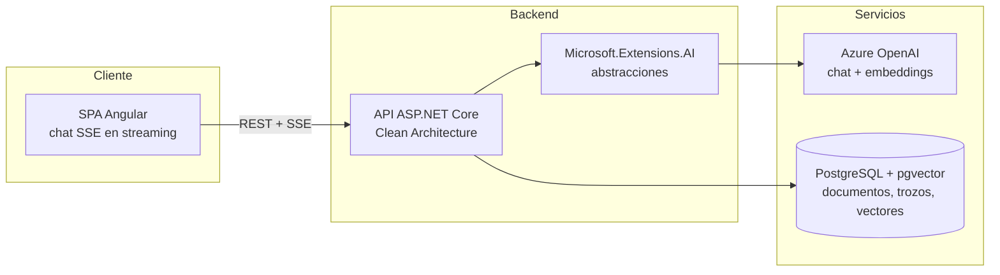

[English](README.md) · **Español**

# DocuMind

Conversa con tus documentos — un asistente de conocimiento basado en RAG que responde preguntas sobre tus PDF citando la página exacta.


## Por qué este proyecto

La mayoría de los chatbots documentales responden con seguridad pero no pueden decirte *de dónde* salió la respuesta. DocuMind está construido alrededor de una generación aumentada por recuperación verificable: cada respuesta se fundamenta en los documentos subidos y cita la página exacta de la que proviene, de modo que el usuario siempre puede comprobar la fuente.

- Sube PDF y pregunta en lenguaje natural.
- Respuestas de chat en streaming (SSE) con citas en línea como `[informe.pdf, p. 12]`.
- Backend con Clean Architecture, diseñado para ser agnóstico del proveedor y testeable.

## Estado del proyecto

La Fase 1 (MVP) está terminada, construida como dos rebanadas verticales:

- **Rebanada A — Ingesta (terminada, verificada en CI):** subida de PDF → extracción de texto por página (PdfPig) → troceado de tamaño fijo (~800 tokens, 15 % de solapamiento, conservando el número de página) → embeddings de Azure OpenAI vía `Microsoft.Extensions.AI` → persistencia en PostgreSQL/pgvector. Incluye la migración inicial de EF Core (extensión vector + índice HNSW), validación de la petición (PDF inválido → 400, límite de tamaño de subida, aviso de texto vacío) y pruebas unitarias.
- **Rebanada B — Chat + UI (terminada, verificada con una demo):** recuperación top-k entre documentos ordenada por distancia coseno de pgvector, un endpoint `/api/chat` en streaming SSE con citas obtenidas de los metadatos de los trozos recuperados, y una interfaz Angular mínima de subida y chat. El número de trozos recuperados (`Retrieval:TopK`, 5 por defecto) es una opción configurable y no secreta. El pipeline del cliente de Azure OpenAI recibe una política de reintento explícita (5 intentos, backoff exponencial, respeta `Retry-After`) para que una llamada de chat limitada por cuota (429) se reintente en lugar de mostrarse al usuario — la cuota del despliegue de chat es deliberadamente estrecha por control de costes, así que los 429 son un caso esperado bajo carga real, no un caso extremo.

La Fase 2 (Autenticación y documentos por usuario) está terminada, entregada como cinco pull requests, cada una de las cuales dejó `main` en estado publicable por sí sola: esquema de Identity (deliberadamente inerte) → endpoints de autenticación y transporte de cookie/XSRF → superficie de autenticación en el cliente y guarda de rutas → propiedad de documentos por usuario con recuperación filtrada por propietario → aplicación de anti-forgery en la subida. Los documentos ya no son una única colección compartida: cada documento tiene un propietario, la recuperación y el listado se limitan a quien llama, y ese aislamiento se demuestra en cada commit con una prueba de integración sobre Testcontainers que verifica que el plan de consulta usa el índice HNSW, no solo que devuelve filas plausibles.

**Siguiente**: una rebanada de diseño dedicada para la interfaz Angular — la actual es funcional pero deliberadamente sin estilo.

Una pasada de endurecimiento sobre la Rebanada A movió la configuración de Azure OpenAI detrás de `dotnet user-secrets`, dejó fijada una vulnerabilidad transitiva de severidad alta en la cadena de dependencias de OpenAPI y dio un nombre fijo al stack de Compose. `dotnet build` y `dotnet test` están limpios: 0 avisos, 0 errores, 34/34 pruebas pasando (29 unitarias, 5 de integración).

## Arquitectura



## Stack tecnológico

| Capa | Tecnología |
| --- | --- |
| Frontend | Angular (componentes standalone, utilidades de Tailwind v4 + componentes spartan/ui (Helm) sobre `@angular/cdk`, chat SSE en streaming, enrutado del lado del cliente + guard de autenticación) |
| Backend | ASP.NET Core sobre .NET 10 (C# 14), Clean Architecture |
| Autenticación | ASP.NET Core Identity — cookie de sesión + CSRF; `/api/documents` y `/api/chat` la exigen, la recuperación y el listado se limitan a los documentos propios del usuario (ver Decisiones clave) |
| IA | Azure OpenAI mediante las abstracciones de Microsoft.Extensions.AI |
| Almacén vectorial | PostgreSQL + pgvector |
| Entorno de desarrollo | Docker Compose |
| CI/CD | GitHub Actions (build + test en cada push) |

## Decisiones clave y su motivo

- **Azure OpenAI detrás de Microsoft.Extensions.AI** — la aplicación depende de las abstracciones `IChatClient` / `IEmbeddingGenerator`, no de un proveedor concreto. Cambiar Azure OpenAI por OpenAI, Ollama o cualquier otro proveedor es una modificación en la raíz de composición, no una reescritura.
- **pgvector sobre PostgreSQL** — una sola base de datos para los datos de negocio y los vectores. No hay un servicio vectorial adicional que ejecutar, respaldar o mantener consistente; los metadatos relacionales y los embeddings conviven y pueden unirse en una única consulta.
- **Troceado de tamaño fijo (~800 tokens, 15 % de solapamiento) con metadatos de página** — cada trozo lleva el número de página de origen, que es lo que hace posible la cita exacta. El solapamiento protege frente a respuestas partidas entre dos trozos.
- **Restauración limitada a nuget.org** — un `NuGet.config` en la raíz del repositorio limpia las fuentes heredadas y restaura únicamente desde el feed público de nuget.org, de modo que un clon nuevo compila igual en cualquier sitio y no puede traer por accidente un paquete interno o suplantado. (El identificador oficial de PdfPig es `PdfPig`, no `UglyToad.PdfPig`.)
- **Vulnerabilidades transitivas fijadas en el nivel superior** — `Microsoft.AspNetCore.OpenApi` 10.0.x declara un suelo exacto de `Microsoft.OpenApi` 2.0.0, y la resolución por versión mínima aplicable de NuGet selecciona precisamente esa versión, que arrastra una vulnerabilidad de severidad alta (GHSA-v5pm-xwqc-g5wc). Ninguna versión de la línea 10.0.x eleva ese suelo, así que actualizar el paquete padre no lo arregla; en su lugar se fija explícitamente la versión parcheada, comentada con el identificador del aviso para poder retirar la fijación cuando el proveedor avance. El mismo enfoque se aplica a `Microsoft.EntityFrameworkCore.Relational` y `Microsoft.Bcl.Memory`. La compilación se mantiene con cero avisos para que un aviso nuevo se vea el día que aparezca, en lugar de perderse entre el ruido.
- **La recuperación DEBE ordenar por distancia coseno, no por "una" distancia cualquiera** — el índice HNSW se declara con la clase de operadores `vector_cosine_ops`, y PostgreSQL solo usa un índice cuando el operador de distancia de la consulta coincide exactamente con la clase de operadores del índice. `EfChunkRepository` ordena con `CosineDistance` de `Pgvector.EntityFrameworkCore`, que se traduce al operador `<=>` (confirmado inspeccionando el SQL generado: `ORDER BY d."Embedding" <=> @queryVector`). Ordenar con `L2Distance` (`<->`) en su lugar compilaría, se ejecutaría y devolvería resultados de apariencia razonable, pero PostgreSQL recurriría en silencio a un escaneo secuencial completo en cada consulta — sin error, sin aviso, solo una consulta mucho más lenta a medida que crece la tabla. Con los volúmenes de fila pequeños de esta demo, PostgreSQL prefiere correctamente un escaneo secuencial de todos modos; ese es el comportamiento esperado del planificador, no una señal de que el índice esté roto.
- **Los reintentos de Azure OpenAI son explícitos en la raíz de composición** — los clientes basados en `System.ClientModel` (como `AzureOpenAIClient`) ya usan por defecto una `ClientRetryPolicy` con backoff exponencial y jitter que respeta la cabecera `Retry-After`, pero ese valor por defecto es fácil de pasar por alto y se limita a 3 intentos. El `DependencyInjection` de `DocuMind.Infrastructure` construye la política de reintento de forma explícita (5 intentos) para que el comportamiento frente a 429 sea visible en el código en lugar de asumido, y fácil de ajustar. Esto importa especialmente aquí: la cuota de tokens por minuto del despliegue de chat es deliberadamente estrecha por control de costes, así que los 429 son una condición esperada bajo carga, no un caso extremo.
- **La URL base de la API es un entorno de Angular, no una constante fija** — `ChatService` lee `environment.apiBaseUrl`. El `fileReplacements` de la configuración de compilación `development` sustituye `environment.ts` por `environment.development.ts` (`http://localhost:5092`, el puerto local de la API); el `environment.ts` por defecto que usa producción entrega `''` a propósito — una base vacía hace que cada petición se resuelva contra el propio origen de la página, lo correcto en cuanto la API es alcanzable desde el mismo origen que el cliente o a través de un proxy inverso, y no es un valor que alguien olvidó rellenar.
- **Ninguna credencial literal en configuración versionada** — `appsettings.json` contiene solo topología de despliegue no secreta (los nombres de los despliegues de modelo); el endpoint y la clave de Azure OpenAI, así como la cadena de conexión de Postgres, provienen de `dotnet user-secrets`, que los guarda fuera del árbol de trabajo. El stack de Compose lee sus credenciales de Postgres de un `.env` no versionado, declaradas *sin* valores por defecto de forma deliberada: un valor por defecto en `docker-compose.yml` seguiría siendo una credencial versionada, así que desplazaría el valor cuatro caracteres a la derecha sin arreglar nada. La configuración ausente falla de forma ruidosa en ambas mitades: Compose se niega a interpolar y la API lanza una excepción al arrancar indicando el comando exacto a ejecutar. `.gitignore` cubre nombres de archivo con forma de credencial como red de seguridad, no como mecanismo.
- **Alojamiento: Azure App Service + Neon** — alojamiento gestionado de la aplicación más Postgres sin servidor mantienen la demo barata de operar y sencilla de desplegar.
- **El esquema de Identity llega antes que cualquier endpoint (Fase 2, PR1 de 5)** — `DocuMindDbContext` ahora también hereda de `IdentityUserContext<ApplicationUser, Guid>`, y una migración crea las tablas `AspNetUsers`/`AspNetUserClaims`/`AspNetUserLogins`/`AspNetUserTokens`. Todavía nada las lee ni las escribe: no existe ningún endpoint de autenticación, no hay middleware de autenticación/autorización registrado y ninguna ruta lo exige. Este PR es deliberadamente inerte — `main` se mantiene funcionalmente idéntico a como estaba antes de añadir esta dependencia — para que el cambio de esquema pueda revisarse y fusionarse por sí solo antes de que lleguen, en PR posteriores, los endpoints, el transporte de cookies/XSRF y la propiedad de documentos por usuario que dependen de él. `ApplicationUser` reside en Infrastructure, no en Domain: deriva de un tipo del framework Identity, lo que la convierte en una preocupación de persistencia, y Domain nunca la consume — la propiedad será un `Guid` simple en la entidad y la clave externa se configura en el `DbContext`. Esto contrasta deliberadamente con la referencia a `Pgvector` en Domain descrita más arriba, que es forzosa y no elegida: EF Core solo puede traducir `CosineDistance` a SQL cuando la propiedad de la entidad está tipada como vector.
- **Endpoints de autenticación y transporte de cookie/XSRF (Fase 2, PR2 de 5)** — `POST /api/account/register`, `POST /api/account/login`, `POST /api/account/logout` y `GET /api/account/me` se construyen directamente sobre `UserManager`/`SignInManager`, no sobre `MapIdentityApi` (que usa tokens portador por defecto — el transporte equivocado para una SPA de navegador). La autenticación por cookie se registra explícitamente como `IdentityConstants.ApplicationScheme` porque `AddIdentityCore` por sí solo no registra `SignInManager` (necesita `.AddSignInManager()`) ni configura autenticación alguna. Se sobrescriben dos comportamientos por defecto que solo se manifiestan en tiempo de ejecución, porque de otro modo romperían en silencio el contrato con el cliente en lugar de fallar al compilar: `Events.OnRedirectToLogin`/`OnRedirectToAccessDenied` devuelven `401`/`403` en lugar de una redirección 302 a una página HTML de inicio de sesión (una API nunca debe redirigir a quien hace un `fetch`), y `PasswordSignInAsync` se llama con `lockoutOnFailure: true` de forma explícita (el valor por defecto de ese argumento no incrementa el contador de bloqueo, lo que dejaría la protección de bloqueo de Identity en algo aspiracional en lugar de real). Se emite de forma proactiva una cookie `XSRF-TOKEN` no `HttpOnly` en cada respuesta de cuenta — incluido un `401` de `/me` — porque el interceptor de antiforgery de Angular solo repite una cookie que ya existe; nunca la solicita. El `HeaderName` propio de antiforgery se fija en `X-XSRF-TOKEN` para coincidir. CORS gana `.AllowCredentials()`, legal solo porque la lista de orígenes es un valor explícito y no un comodín. Nada exige aún autenticación: `.RequireAuthorization()` no se aplica a ningún endpoint existente, así que `main` se mantiene como una aplicación completamente funcional y sin autenticar hasta que la propiedad por usuario llegue en el PR4.
- **Superficie de autenticación del cliente (Fase 2, PR3 de 5)** — la primera tabla de rutas real de la aplicación: `/login`, `/register` y una ruta `/` protegida por un `authGuard` funcional. La autenticación por cookie no lleva reclamaciones legibles por el cliente, así que `AuthService.ensureBootstrapped()` llama a `GET /api/account/me` una vez por carga de la aplicación (deduplicado entre navegaciones concurrentes mediante una promesa en curso cacheada) antes de que el guard decida nada. `provideHttpClient` ahora declara explícitamente `withXsrfConfiguration({ cookieName: 'XSRF-TOKEN', headerName: 'X-XSRF-TOKEN' })`, coincidiendo con el `AntiforgeryOptions.HeaderName` del servidor a propósito y no por suerte. Junto a él corre un `apiInterceptor` dedicado: el propio interceptor XSRF de Angular compara el origen de la petición con el origen *de la página* y no hace nada cuando difieren (verificado contra el código fuente instalado de `@angular/common` v22.0.7, no asumido), y en desarrollo `environment.apiBaseUrl` (`http://localhost:5092`) es precisamente un origen distinto del servidor de desarrollo de Angular (`http://localhost:4200`) — así que, sin este interceptor, en cuanto el PR5 elimine `.DisableAntiforgery()`, la subida en desarrollo fallaría la validación antiforgery de un modo que parecería un error del servidor. No hace nada en producción, donde `apiBaseUrl` es `''` y toda petición es del mismo origen, así que el comportamiento propio de Angular ya basta. `ChatService.ask()` usa `fetch` directamente, lo que evita todos los interceptores de Angular: ahora envía `credentials: 'include'` (su valor por defecto, `'same-origin'`, descartaría la cookie en silencio en el límite de desarrollo `:4200`→`:5092`) y lee y adjunta `X-XSRF-TOKEN` por sí mismo desde `document.cookie`. Un `401` en la petición *inicial* de `/api/chat` (un 401 a mitad de streaming no puede ocurrir — el estado HTTP se fija antes de que empiece el streaming SSE) ahora muestra un mensaje visible y redirige a `/login` a través del mismo `AuthService` que usa el guard, en lugar de convertirse en un rechazo sin gestionar. El servidor todavía no exige autenticación (eso llega en el PR4): confirmado ejecutando la API contra el contenedor Postgres real de extremo a extremo — registro → `/me` autenticado por cookie → preflight de CORS para el origen `:4200` con credenciales permitidas → cierre de sesión → `/me` vuelve a devolver `401` → `/api/chat` sin autenticar sigue transmitiendo `200`, lo que demuestra que `main` sigue sirviendo la subida y el chat exactamente como antes.
- **Propiedad y recuperación filtrada (Fase 2, PR4 de 5)** — cada `Document` tiene ahora un `OwnerId` autoritativo (uuid, `NOT NULL`, clave externa a `AspNetUsers.Id` con `ON DELETE RESTRICT` — eliminar una cuenta no debe destruir en silencio los documentos, trozos y embeddings de esa cuenta; todavía no existe un flujo de eliminación de cuentas, que es precisamente por lo que aquí importa `Restrict` y no `Cascade`, registrado como pendiente conocido más abajo). `DocumentChunk` también lleva su propio `OwnerId`, desnormalizado a propósito en lugar de resuelto mediante una unión: el índice HNSW vive en `document_chunks`, así que filtrar por propietario a través de `documents` colocaría el predicado *por encima* del escaneo ordenado del índice como una semi-unión — la forma de plan menos predecible disponible, y la misma clase de fallo "compila, se ejecuta, plan silenciosamente equivocado" que este proyecto ya ha sufrido una vez (ver la nota sobre el operador coseno más arriba). Las dos columnas no pueden desalinearse por accidente: `documents` gana una clave alternativa en `(Id, OwnerId)`, y la clave externa de `document_chunks` se vuelve compuesta — `(DocumentId, OwnerId) → documents (Id, OwnerId)`, `ON DELETE CASCADE` — de modo que la base de datos rechaza cualquier fila de trozo cuyo propietario no coincida con el de su propio documento, en lugar de depender de que cada ruta de escritura lo haga bien. La migración que añade estas columnas `NOT NULL` empieza con `DELETE FROM document_chunks; DELETE FROM documents;` dentro del mismo `Up()` — combinar el truncado y la adición de columnas en una sola migración (en lugar de dos) hace que un clon nuevo que aplique todas las migraciones en orden reproduzca el mismo esquema que obtiene un entorno truncado a mano, y un documento subido entre dos migraciones separadas nunca podría hacer fallar la segunda; `Down()` no puede deshacer el borrado, y lo dice en voz alta en el comentario XML de la migración. `IChunkRepository.SearchAsync` recibe ahora `ownerId` como su primer parámetro, obligatorio — no uno opcional añadido al final con un valor por defecto, que compilaría en todas partes sin cambios y preservaría en silencio exactamente la consulta sin filtrar que este cambio existe para eliminar — y `EfChunkRepository` filtra `document_chunks` por él antes del `ORDER BY`, manteniendo el predicado de una sola tabla sobre la misma relación en la que vive el índice. Ese filtro depende de un ajuste en tiempo de ejecución fácil de omitir en un clon nuevo: la cadena de conexión de Postgres debe llevar `Options=-c hnsw.iterative_scan=strict_order` (ver Puesta en marcha), porque de otro modo el índice HNSW de pgvector aplica el filtro de propietario *después* del escaneo ordenado y puede devolver en silencio menos resultados de los solicitados en lugar de continuar el escaneo — una comprobación de arranque (`RetrievalPrerequisiteCheck`, ejecutada una vez después de construir la aplicación y antes de empezar a servir) consulta directamente la conexión en ejecución y **lanza una excepción** si falta ese ajuste o si la extensión `vector` instalada es anterior a la 0.8.0 (la versión en la que aparecieron los escaneos iterativos; la etiqueta de imagen `pgvector/pgvector:pg17` es flotante, así que esto se vuelve a comprobar en cada arranque, no solo una vez). `POST /api/documents`, `GET /api/documents` (nuevo — lista solo los documentos propios del que llama, y nunca devuelve el campo de propietario) y `POST /api/chat` llevan ahora `.RequireAuthorization()`. La garantía de aislamiento por propietario se demuestra con una prueba de integración automatizada con Testcontainers, no con una transcripción manual, porque es una propiedad de seguridad que debe cumplirse en cada commit: siembra 3 usuarios × 3 documentos cada uno con unos 5.000 trozos usando embeddings colocados analíticamente (de modo que el ranking top-k esperado se conoce de antemano con exactitud, no solo de forma verosímil), captura el SQL *real* que emite `EfChunkRepository.SearchAsync`, lo vuelve a ejecutar como `EXPLAIN ANALYZE` para confirmar que PostgreSQL eligió el escaneo por índice HNSW en lugar de un escaneo secuencial, y comprueba que las filas devueltas pertenecen exclusivamente a quien hizo la consulta. Este es el único punto en el que `dotnet test backend/DocuMind.slnx` necesita ahora Docker en ejecución local, además del Postgres de Compose — `ubuntu-latest` ya incluye Docker, así que la CI no necesitó cambios de flujo de trabajo. `.DisableAntiforgery()` en `/api/documents` se mantiene exactamente igual durante un PR más: el endpoint ya está autenticado, así que la justificación original (sin sesión ambiental que falsificar) ya no se sostiene, pero retirar la llamada depende de la corrección del interceptor para URL absolutas de Angular que el PR3 ya introdujo precisamente por este motivo — la propia retirada, junto con la justificación de la asimetría CSRF de `/api/chat`, llegan juntas en el PR5.
- **Anti-forgery obligatorio en la subida, deliberadamente ausente en el chat (Fase 2, PR5 de 5)** — `.DisableAntiforgery()` ha desaparecido de `POST /api/documents`, y la *ausencia* de esa llamada es todo el mecanismo: las minimal APIs adjuntan metadatos de anti-forgery automáticamente a cualquier endpoint que enlace un `IFormFile`, de modo que el endpoint exige un token válido por defecto y la única forma de debilitarlo es volver a añadir la llamada. `POST /api/chat` no recibe ese filtro, y esa asimetría es una decisión, no un olvido. Un formulario HTML de otro origen puede enviar `multipart/form-data` con la cookie de sesión adjunta y sin preflight de CORS — esa es exactamente la forma clásica de un ataque CSRF, y es la razón por la que el endpoint de subida necesita un token. Ese mismo formulario *no puede* fijar `Content-Type: application/json`, que es el único tipo de contenido que acepta `/api/chat`; una petición JSON obliga por tanto a un preflight de CORS, que una lista explícita de orígenes sin comodines rechaza, y el alcance `SameSite` de la cookie impide además que la sesión se adjunte. Exigir un token ahí no defendería de nada y rompería el `fetch` directo del que depende el streaming SSE. Ambas mitades quedan fijadas como aserciones en `EndpointSecurityMetadataTests`, que lee los metadatos que ASP.NET Core construye realmente para cada endpoint, porque una propiedad de seguridad expresada como una ausencia resulta invisible para el resto de la batería de pruebas y para quien revisa un diff por encima: volver a añadir una llamada compilaría, mantendría verdes todas las demás pruebas y eliminaría en silencio la protección CSRF del único endpoint multipart que modifica estado. Merece la pena registrar dos detalles, ambos verificados en lugar de supuestos. Primero, `DisableAntiforgery()` no elimina los metadatos: añade una entrada cuyo `RequiresValidation` es `false`, así que comprobar únicamente que los metadatos *existen* pasaría incluso con la protección desactivada; la aserción apunta a la propiedad. Segundo, se confirmó que la prueba falla volviendo a añadir la llamada de forma temporal, porque una prueba de seguridad que nunca se ha visto fallar es decoración. Activar la exigencia solo fue seguro porque la PR3 ya había incorporado el `apiInterceptor` que adjunta el token en las peticiones de desarrollo hacia otro origen (ADR-J): sin él, este cambio habría roto todas las subidas locales de una forma que parece un error del servidor. Conviene revisar esta decisión si `/api/chat` llegara a aceptar un formulario, o si la lista de orígenes CORS incorporara un comodín — cualquiera de las dos invalidaría el razonamiento anterior, no las aserciones.
- **Base de Tailwind v4 + spartan/ui (Helm), cero hojas de estilo por componente (ui-redesign, PR1 de 5)** — la pasada de diseño del cliente Angular llega como cinco commits secuenciales sobre la conversión de SCSS a CSS de la rebanada anterior. Este primer commit añade solo la base tecnológica: Tailwind v4 mediante `@tailwindcss/postcss` (autodetectado a través de un nuevo `.postcssrc.json`), la biblioteca de componentes `spartan/ui` (Helm) sobre `@angular/cdk`, y una única hoja de estilos global `src/styles.css` que define un conjunto de tokens de diseño claro y otro oscuro — el modo oscuro se entrega por defecto (`<html lang="en" class="dark">`); un selector de tema visible queda fuera de alcance por ahora. El encapsulado emulado por defecto de Angular ya había limitado siete de las ocho reglas de estilo heredadas de componente a una plantilla que nunca las usaba (confirmado leyendo cada archivo, no asumido); eliminar la única regla que quedaba y trasladar su efecto real — el centrado de `.app-shell` — a utilidades de Tailwind sobre `<main>` no cuesta nada más que este commit. Un efecto visible que merece nombrarse en vez de descubrirse más tarde: el reset de Tailwind (`preflight`) elimina el estilo por defecto del navegador para `button`/`input`/encabezados antes de que existan los componentes que lo sustituirán, así que la aplicación se ve visiblemente sin estilo entre este commit y los commits de restilizado que siguen más adelante en esta rebanada — una concesión deliberada, aceptada y con fecha de caducidad, no una regresión que corregir aquí. El keyframe `blink` del cursor de streaming (muerto desde su origen, y confirmado muerto de nuevo aquí) se traslada a una utilidad reutilizable `animate-blink` en esta misma hoja de estilos; empieza a renderizarse de verdad solo cuando un commit posterior de esta rebanada la aplique a la plantilla del chat.

## Puesta en marcha

Requisitos previos: SDK de .NET 10, Node.js 22+, pnpm, Docker.

El fragmento `Options=-c hnsw.iterative_scan=strict_order` del paso 3 siguiente es obligatorio, no
opcional (Fase 2, PR4): la recuperación filtra `document_chunks` por propietario antes del
escaneo ordenado del índice HNSW, y sin este ajuste en la conexión PostgreSQL puede devolver en
silencio menos resultados de los solicitados en lugar de continuar el escaneo. La API comprueba
este ajuste (y que la extensión `vector` instalada sea >= 0.8.0) una vez al arrancar y se niega a
iniciarse si alguna de las dos comprobaciones falla — un clon nuevo que omita el fragmento recibe
un error explícito y accionable en lugar de un déficit silencioso de resultados en tiempo de
consulta. `dotnet test backend/DocuMind.slnx` también arranca ahora su propio contenedor Postgres
desechable (Testcontainers) para la prueba de integración de aislamiento por propietario, así que
Docker debe estar en ejecución localmente para la batería de pruebas del backend, además del
Postgres de Compose anterior.

```bash
# 1. Crea el archivo de entorno local. Contiene las credenciales desechables del
#    contenedor Postgres de desarrollo y no se versiona. Compose falla con un
#    mensaje explícito si falta.
cp .env.example .env

# 2. Arranca PostgreSQL con pgvector
docker compose up -d

# 3. Aporta los secretos de la API. Viven en user-secrets, fuera del árbol de
#    trabajo, así que nunca se versionan. El UserSecretsId ya está declarado en
#    DocuMind.Api.csproj, por lo que no hay nada que inicializar. La cadena de
#    conexión debe coincidir con las credenciales de .env — ver la nota en
#    .env.example.
cd backend/src/DocuMind.Api
dotnet user-secrets set "ConnectionStrings:Postgres" "Host=localhost;Port=5432;Database=documind;Username=documind;Password=documind_dev;Options=-c hnsw.iterative_scan=strict_order"
dotnet user-secrets set "AzureOpenAI:Endpoint" "https://<tu-recurso>.openai.azure.com/"
dotnet user-secrets set "AzureOpenAI:ApiKey" "<tu-clave>"

# 4. Ejecuta la API
dotnet run

# 5. Ejecuta el cliente Angular
cd ../../../client
pnpm install
pnpm start
```

Los nombres de los despliegues de modelo se entregan como valores por defecto
versionados en `appsettings.json` (`text-embedding-3-small` para embeddings y
`gpt-5-mini` para chat) porque son topología de despliegue, no credenciales.
Sobrescríbelos igual que los secretos anteriores si tus despliegues de Azure
tienen otros nombres:

```bash
dotnet user-secrets set "AzureOpenAI:EmbeddingDeployment" "<tu-despliegue-de-embeddings>"
dotnet user-secrets set "AzureOpenAI:ChatDeployment" "<tu-despliegue-de-chat>"
```

El número de trozos recuperados por pregunta (`Retrieval:TopK`, 5 por defecto) también es un
valor por defecto versionado y no secreto en `appsettings.json` — sobrescríbelo del mismo modo
si lo necesitas:

```bash
dotnet user-secrets set "Retrieval:TopK" "8"
```

## Ramas y versionado

| Rama | Función |
| --- | --- |
| `main` | Siempre publicable. Protegida: sin subidas directas, los cambios entran por pull request con la CI en verde. |
| `production` | Lo que está desplegado. Se avanza por fast-forward desde `main` al publicar; nunca se commitea directamente sobre ella. |
| `feat/*`, `fix/*`, `chore/*`, `docs/*` | De vida corta, una unidad de trabajo cada una, se eliminan tras la fusión. |

Los commits siguen [Conventional Commits](https://www.conventionalcommits.org/). Eso es lo que
permite construir el registro de cambios a partir del historial en lugar de mantenerlo a mano, y
por eso el tipo de commit no es decorativo. Los prefijos de rama reutilizan deliberadamente el
mismo vocabulario — `feat/`, no `feature/` — para que el nombre de una rama y los commits que
contiene no puedan contradecirse sobre qué clase de cambio transporta.

Las publicaciones son [versiones semánticas](https://semver.org/) etiquetadas en `main` como
`vMAYOR.MENOR.PARCHE`, registradas en [CHANGELOG.md](CHANGELOG.md) y promovidas por fast-forward,
de modo que `production` nunca puede contener un commit que `main` no haya visto:

```bash
git switch production && git merge --ff-only main && git push origin production
```

Antes de la 1.0, la versión menor marca una fase completada y la de parche marca correcciones
dentro de ella.

**Por qué no Git Flow.** Su estructura de `develop`/`release`/`hotfix` existe para mantener
varias versiones publicadas en paralelo. Este proyecto entrega una única versión de forma
continua, así que esas ramas añadirían ceremonia sin responder a ninguna pregunta que el proyecto
tenga realmente — algo que su propio autor ha señalado después para el software de entrega
continua.

## Hoja de ruta

- [x] **Fase 1 — MVP**: subida de PDF, canalización de troceado y embeddings, chat en streaming con citas de página exactas.
- [x] **Fase 2 — Autenticación y colecciones**: cuentas de usuario, autenticación por cookie con protección CSRF y propiedad de documentos por usuario, exigida en el esquema, en el sistema de tipos y en la tabla de rutas. Las colecciones con nombre dentro de los documentos de un usuario siguen siendo una rebanada posterior e independiente.
- [ ] **Fase 3 — Calidad**: historial de conversación, reordenación de la recuperación, arnés de evaluación de respuestas, caché semántica de respuestas.
- [ ] **Fase 4 — Producción**: batería de pruebas más amplia, CI/CD, despliegue de una demo pública.

### Pendientes conocidos

- [ ] **Retirar la fijación de `Microsoft.OpenApi`** cuando `Microsoft.AspNetCore.OpenApi` eleve el suelo de su dependencia por encima de la versión parcheada, momento en el que la fijación pasa a ser redundante.
- [ ] **Pasada de diseño sobre la interfaz Angular.** Los componentes de subida y chat son deliberadamente mínimos y sin estilo — funcionales para la demo, no representativos del diseño de producto previsto. Pendiente de que se planifique una rebanada de diseño dedicada.
- [ ] **Caché semántica de respuestas.** Diferida deliberadamente fuera de la Rebanada B — necesita una tabla nueva y una ruta de búsqueda propia, lo que habría mezclado una preocupación no relacionada en la implementación del chat. Pendiente en cuanto la latencia o el coste de preguntas repetidas se convierta en un problema medido que merezca la pena resolver.
- [ ] **Entidad `Collection` — colecciones con nombre dentro de los documentos de un usuario.** La Fase 2 entregó *propiedad* por usuario: cada documento pertenece a una cuenta y la recuperación se limita a quien llama. No entregó colecciones que el usuario pueda nombrar y en las que organizar sus documentos, algo que la redacción del punto de la Fase 2 en la hoja de ruta («colecciones de documentos por usuario») podría dar a entender. La propiedad plana se eligió de forma deliberada: una entidad `Collection` habría añadido una segunda dimensión de alcance a cada consulta y a cada decisión de índice mientras la propiedad misma seguía sin estar demostrada. Pendiente cuando un usuario acumule suficientes documentos para que una lista plana deje de ser navegable, lo cual es una señal de producto y no técnica.
- [ ] **Fijar la etiqueta de la imagen de `pgvector`.** Tanto `docker-compose.yml` como el fixture de Testcontainers usan `pgvector/pgvector:pg17`, una etiqueta flotante. Una reconstrucción puede por tanto mover en silencio la versión instalada de la extensión `vector`, y la recuperación filtrada por propietario de la Fase 2 depende de que esa versión sea al menos 0.8.0 para los escaneos iterativos — que es justamente el motivo por el que `RetrievalPrerequisiteCheck` lo vuelve a comprobar en cada arranque y no una sola vez. Esa comprobación convierte una regresión silenciosa en una ruidosa, pero no la evita. Pendiente antes de cualquier despliegue que no pueda tolerar un cambio imprevisto de la imagen de base de datos; la solución es fijar un digest, y la comprobación de arranque se mantiene en cualquier caso como red de seguridad.
- [ ] **Pruebas de los endpoints de cuenta a través de HTTP.** `AccountIdentityBehaviourTests` verifica el comportamiento de Identity ante email duplicado, contraseña incorrecta y bloqueo de cuenta contra una base de datos real, incluido que la contraseña correcta se rechaza mientras la cuenta está bloqueada. Sin embargo, esa prueba pasa ella misma `lockoutOnFailure: true`, de modo que no puede detectar que ese argumento se cambie a `false` en el punto de llamada del endpoint de login, ni comprobar qué cookies establece y qué cookies no establece un login fallido, que es una propiedad de nivel HTTP. Pendiente si los endpoints de cuenta ganan más comportamiento que los cuatro actuales, momento en el que un arnés `WebApplicationFactory` se amortiza; el motivo de que aún no exista es que arrancar la aplicación en las pruebas arrastra la configuración de Azure OpenAI y la comprobación de recuperación en el arranque, y ambas requieren sobrescritura deliberada.
- [ ] **Eliminación de cuentas.** La clave externa de `documents.OwnerId` hacia `AspNetUsers` es `ON DELETE RESTRICT` a propósito (Fase 2, PR4): eliminar una cuenta no debe destruir en silencio los documentos, trozos y embeddings de esa cuenta. Todavía no existe un flujo de eliminación de cuentas, así que esto es por ahora latente y no se ejerce. Pendiente en cuanto se introduzca dicho flujo — necesitará una decisión explícita (bloquear la eliminación mientras existan documentos, o eliminarlos en cascada de forma deliberada) en lugar de heredar lo que `Restrict` haga hoy por defecto.
