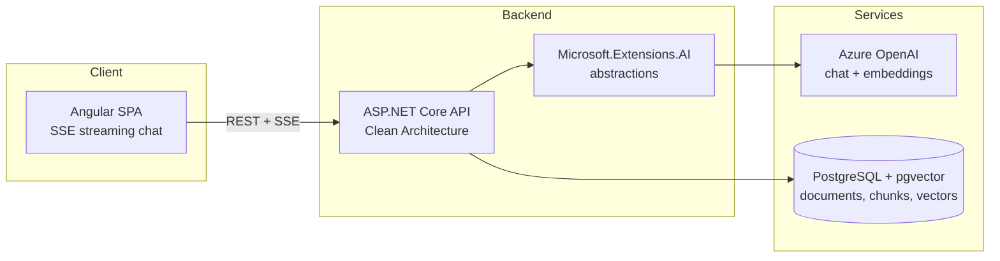

# DocuMind

Chat with your documents — a RAG-powered knowledge assistant that answers questions about your PDFs with exact page citations.

<!-- Badges: build status, coverage, license — added once CI is in place -->

## Why this project

Most document chatbots answer confidently but can't tell you *where* the answer came from. DocuMind is built around verifiable retrieval-augmented generation: every answer is grounded in the uploaded documents and cites the exact page it came from, so users can always check the source.

- Upload PDFs, ask questions in natural language.
- Streaming chat responses (SSE) with inline citations like `[report.pdf, p. 12]`.
- Clean Architecture backend designed to be provider-agnostic and testable.

## Architecture



## Tech stack

| Layer | Technology |
| --- | --- |
| Frontend | Angular (standalone components, SCSS, SSE streaming chat) |
| Backend | ASP.NET Core on .NET 10 (C# 14), Clean Architecture |
| AI | Azure OpenAI via Microsoft.Extensions.AI abstractions |
| Vector store | PostgreSQL + pgvector |
| Dev environment | Docker Compose |
| CI/CD | GitHub Actions (planned) |

## Key decisions and why

- **Azure OpenAI behind Microsoft.Extensions.AI** — the application depends on `IChatClient` / `IEmbeddingGenerator` abstractions, not on a concrete provider. Swapping Azure OpenAI for OpenAI, Ollama, or any other provider is a composition-root change, not a rewrite.
- **pgvector on PostgreSQL** — one database for both business data and vectors. No extra vector-store service to run, back up, or keep consistent; relational metadata and embeddings live side by side and can be joined in a single query.
- **Fixed-size chunking (~800 tokens, 15% overlap) with page metadata** — chunks carry the source page number, which is what makes exact page citations possible. Overlap protects against answers being split across chunk boundaries.
- **Hosting: Azure App Service + Neon** — managed app hosting plus serverless Postgres keeps the demo cheap to run and simple to deploy.

## Getting started

Prerequisites: .NET 10 SDK, Node.js 22+, Docker.

```bash
# 1. Start PostgreSQL with pgvector
docker compose up -d

# 2. Run the API
cd backend/src/DocuMind.Api
dotnet run

# 3. Run the Angular client
cd client
npm install
ng serve
```

## Roadmap

- [ ] **Phase 1 — MVP**: PDF upload, chunking + embedding pipeline, streaming chat with exact page citations.
- [ ] **Phase 2 — Auth & collections**: user accounts and per-user document collections.
- [ ] **Phase 3 — Quality**: conversation history, retrieval re-ranking, answer evaluation harness.
- [ ] **Phase 4 — Production**: test suite, CI/CD with GitHub Actions, public demo deployment.
