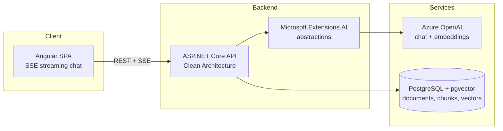

# DocuMind

Chat with your documents — a RAG-powered knowledge assistant that answers questions about your PDFs with exact page citations.


## Why this project

Most document chatbots answer confidently but can't tell you *where* the answer came from. DocuMind is built around verifiable retrieval-augmented generation: every answer is grounded in the uploaded documents and cites the exact page it came from, so users can always check the source.

- Upload PDFs, ask questions in natural language.
- Streaming chat responses (SSE) with inline citations like `[report.pdf, p. 12]`.
- Clean Architecture backend designed to be provider-agnostic and testable.

## Project status

Phase 1 (MVP) is in progress, built as two vertical slices:

- **Slice A — Ingestion (done, CI-verified):** PDF upload → per-page text extraction (PdfPig) → fixed-size chunking (~800 tokens, 15% overlap, page number preserved) → Azure OpenAI embeddings via `Microsoft.Extensions.AI` → persistence to PostgreSQL/pgvector. Includes the initial EF Core migration (vector extension + HNSW index), request validation (invalid-PDF → 400, upload size cap, empty-text warning), and unit tests.
- **Slice B — Chat + UI (next):** cross-document top-k retrieval, SSE streaming chat endpoint with citations, and the Angular chat/upload UI.

A hardening pass on top of Slice A moved Azure OpenAI configuration behind `dotnet user-secrets`, pinned out a high-severity transitive advisory in the OpenAPI dependency chain, made the anti-forgery posture of the unauthenticated upload endpoint explicit, and gave the Compose stack a fixed project name. `dotnet build` and `dotnet test` are clean: 0 warnings, 0 errors, 10/10 tests passing.

## Architecture



## Tech stack

| Layer | Technology |
| --- | --- |
| Frontend | Angular (standalone components, SCSS, SSE streaming chat) |
| Backend | ASP.NET Core on .NET 10 (C# 14), Clean Architecture |
| AI | Azure OpenAI via Microsoft.Extensions.AI abstractions |
| Vector store | PostgreSQL + pgvector |
| Dev environment | Docker Compose |
| CI/CD | GitHub Actions (build + test on every push) |

## Key decisions and why

- **Azure OpenAI behind Microsoft.Extensions.AI** — the application depends on `IChatClient` / `IEmbeddingGenerator` abstractions, not on a concrete provider. Swapping Azure OpenAI for OpenAI, Ollama, or any other provider is a composition-root change, not a rewrite.
- **pgvector on PostgreSQL** — one database for both business data and vectors. No extra vector-store service to run, back up, or keep consistent; relational metadata and embeddings live side by side and can be joined in a single query.
- **Fixed-size chunking (~800 tokens, 15% overlap) with page metadata** — chunks carry the source page number, which is what makes exact page citations possible. Overlap protects against answers being split across chunk boundaries.
- **Restore locked to nuget.org** — a repo-root `NuGet.config` clears inherited sources and restores only from the public nuget.org feed, so a fresh clone builds identically anywhere and can't accidentally pull an internal or typosquatted package. (The official PdfPig package id is `PdfPig`, not `UglyToad.PdfPig`.)
- **Transitive vulnerabilities pinned at the top level** — `Microsoft.AspNetCore.OpenApi` 10.0.x declares an exact `Microsoft.OpenApi` 2.0.0 floor, and NuGet's lowest-applicable resolution then selects precisely that version, which carries a high-severity advisory (GHSA-v5pm-xwqc-g5wc). No release in the 10.0.x line raises the floor, so upgrading the parent package cannot fix it; the patched version is pinned explicitly instead, commented with the advisory id so the pin can be dropped once upstream moves. Same approach for `Microsoft.EntityFrameworkCore.Relational` and `Microsoft.Bcl.Memory`. The build is kept at zero warnings so a new advisory is visible the day it lands rather than lost in noise.
- **Secrets via user-secrets, not tracked config** — `appsettings.json` carries only non-secret deployment topology (the model deployment names). The Azure OpenAI endpoint and API key are supplied by `dotnet user-secrets`, which stores them outside the working tree, and `.gitignore` keeps credential-shaped filenames out as a safety net rather than as the mechanism.
- **Hosting: Azure App Service + Neon** — managed app hosting plus serverless Postgres keeps the demo cheap to run and simple to deploy.

## Getting started

Prerequisites: .NET 10 SDK, Node.js 22+, pnpm, Docker.

```bash
# 1. Start PostgreSQL with pgvector
docker compose up -d

# 2. Supply the Azure OpenAI credentials. They live in user-secrets, outside the
#    working tree, so they are never committed. The UserSecretsId is already
#    declared in DocuMind.Api.csproj, so there is nothing to initialise.
cd backend/src/DocuMind.Api
dotnet user-secrets set "AzureOpenAI:Endpoint" "https://<your-resource>.openai.azure.com/"
dotnet user-secrets set "AzureOpenAI:ApiKey" "<your-key>"

# 3. Run the API
dotnet run

# 4. Run the Angular client
cd ../../../client
pnpm install
pnpm start
```

The model deployment names ship as checked-in defaults in `appsettings.json`
(`text-embedding-3-small` for embeddings, `gpt-5-mini` for chat) because they are
deployment topology, not credentials. Override them the same way as the secrets
above if your Azure deployments are named differently:

```bash
dotnet user-secrets set "AzureOpenAI:EmbeddingDeployment" "<your-embedding-deployment>"
dotnet user-secrets set "AzureOpenAI:ChatDeployment" "<your-chat-deployment>"
```

## Roadmap

- [ ] **Phase 1 — MVP**: PDF upload, chunking + embedding pipeline (done), streaming chat with exact page citations (next).
- [ ] **Phase 2 — Auth & collections**: user accounts and per-user document collections.
- [ ] **Phase 3 — Quality**: conversation history, retrieval re-ranking, answer evaluation harness.
- [ ] **Phase 4 — Production**: broader test suite, CI/CD, public demo deployment.

### Known follow-ups

- [ ] **Move the database credentials out of tracked configuration.** The Postgres user and password are currently the same literal in `docker-compose.yml` and the `appsettings.json` connection string. That is deliberate and harmless while the only database is a throwaway container on `localhost`, but it stops being harmless the moment a shared environment exists — staging, a demo stack, or CI with a persistent database. `user-secrets` is already wired for the API, so the local half has a home; the Compose half needs an `.env` file or environment variables. Do this **before** standing up the first non-localhost environment, not after.
- [ ] **Revisit anti-forgery on `POST /api/documents`.** It is explicitly disabled because the endpoint is unauthenticated in Phase 1, so there is no ambient session for a browser to replay and a token would add friction without adding safety. Once Phase 2 introduces authentication that reasoning expires. The call site carries an inline `REVISIT` marker.
- [ ] **Drop the `Microsoft.OpenApi` pin** once `Microsoft.AspNetCore.OpenApi` raises its dependency floor above the patched version, at which point the pin is redundant.
