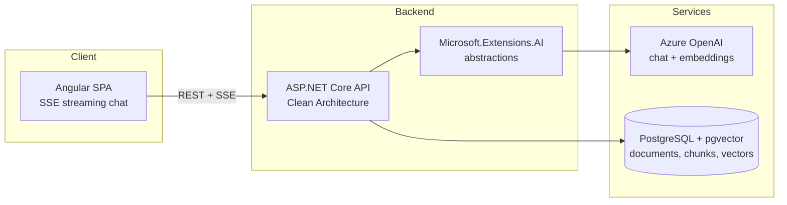

**English** · [Español](README.es.md)

# DocuMind

Chat with your documents — a RAG-powered knowledge assistant that answers questions about your PDFs with exact page citations.


## Why this project

Most document chatbots answer confidently but can't tell you *where* the answer came from. DocuMind is built around verifiable retrieval-augmented generation: every answer is grounded in the uploaded documents and cites the exact page it came from, so users can always check the source.

- Upload PDFs, ask questions in natural language.
- Streaming chat responses (SSE) with inline citations like `[report.pdf, p. 12]`.
- Clean Architecture backend designed to be provider-agnostic and testable.

## Project status

Phase 1 (MVP) is complete, built as two vertical slices:

- **Slice A — Ingestion (done, CI-verified):** PDF upload → per-page text extraction (PdfPig) → fixed-size chunking (~800 tokens, 15% overlap, page number preserved) → Azure OpenAI embeddings via `Microsoft.Extensions.AI` → persistence to PostgreSQL/pgvector. Includes the initial EF Core migration (vector extension + HNSW index), request validation (invalid-PDF → 400, upload size cap, empty-text warning), and unit tests.
- **Slice B — Chat + UI (done, demo-verified):** cross-document top-k retrieval ordered by pgvector cosine distance, a streaming `/api/chat` SSE endpoint with citations sourced from retrieved-chunk metadata, and a minimal Angular upload/chat UI. Retrieval `k` is a configurable, non-secret setting (`Retrieval:TopK`, default 5). The Azure OpenAI client pipeline is given an explicit retry policy (5 attempts, exponential backoff, honours `Retry-After`) so a rate-limited (429) chat call is retried rather than surfaced to the user — the chat deployment's quota is deliberately narrow for cost control, so 429s are expected under any real load.
- **Phase 1 next**: a dedicated design slice for the Angular UI — the current one is functional but intentionally unstyled.

A hardening pass on top of Slice A moved Azure OpenAI configuration behind `dotnet user-secrets`, pinned out a high-severity transitive advisory in the OpenAPI dependency chain, made the anti-forgery posture of the unauthenticated upload endpoint explicit, and gave the Compose stack a fixed project name. `dotnet build` and `dotnet test` are clean: 0 warnings, 0 errors, 14/14 tests passing.

## Architecture



## Tech stack

| Layer | Technology |
| --- | --- |
| Frontend | Angular (standalone components, SCSS, SSE streaming chat) |
| Backend | ASP.NET Core on .NET 10 (C# 14), Clean Architecture |
| Auth | ASP.NET Core Identity (schema only so far — see Key decisions) |
| AI | Azure OpenAI via Microsoft.Extensions.AI abstractions |
| Vector store | PostgreSQL + pgvector |
| Dev environment | Docker Compose |
| CI/CD | GitHub Actions (build + test on every push) |

## Key decisions and why

- **Azure OpenAI behind Microsoft.Extensions.AI** — the application depends on `IChatClient` / `IEmbeddingGenerator` abstractions, not on a concrete provider. Swapping Azure OpenAI for OpenAI, Ollama, or any other provider is a composition-root change, not a rewrite.
- **pgvector on PostgreSQL** — one database for both business data and vectors. No extra vector-store service to run, back up, or keep consistent; relational metadata and embeddings live side by side and can be joined in a single query.
- **Fixed-size chunking (~800 tokens, 15% overlap) with page metadata** — chunks carry the source page number, which is what makes exact page citations possible. Overlap protects against answers being split across chunk boundaries.
- **Restore locked to nuget.org** — a repo-root `NuGet.config` clears inherited sources and restores only from the public nuget.org feed, so a fresh clone builds identically anywhere and can't accidentally pull an internal or typosquatted package. (The official PdfPig package id is `PdfPig`, not `UglyToad.PdfPig`.)
- **Transitive vulnerabilities pinned at the top level** — `Microsoft.AspNetCore.OpenApi` 10.0.x declares an exact `Microsoft.OpenApi` 2.0.0 floor, and NuGet's lowest-applicable resolution then selects precisely that version, which carries a high-severity advisory (GHSA-v5pm-xwqc-g5wc). No release in the 10.0.x line raises the floor, so upgrading the parent package cannot fix it; the patched version is pinned explicitly instead, commented with the advisory id so the pin can be dropped once upstream moves. Same approach for `Microsoft.EntityFrameworkCore.Relational` and `Microsoft.Bcl.Memory`. The build is kept at zero warnings so a new advisory is visible the day it lands rather than lost in noise.
- **Retrieval MUST order by cosine distance, not just "a" distance** — the HNSW index is declared with the `vector_cosine_ops` operator class, and PostgreSQL only uses an index when the query's distance operator matches the index's operator class exactly. `EfChunkRepository` orders with `Pgvector.EntityFrameworkCore`'s `CosineDistance`, which translates to the `<=>` operator (confirmed by inspecting the generated SQL: `ORDER BY d."Embedding" <=> @queryVector`). Ordering by `L2Distance` (`<->`) instead would compile, run, and return plausible-looking results, but PostgreSQL would silently fall back to a full sequential scan on every query — no error, no warning, just a much slower query as the table grows. At the small row counts in this demo, PostgreSQL correctly prefers a sequential scan anyway; that is expected planner behaviour, not evidence the index is broken.
- **Azure OpenAI retries are explicit in the composition root** — `System.ClientModel`-based clients (which `AzureOpenAIClient` is) already default to a `ClientRetryPolicy` with exponential backoff and jitter that honours the `Retry-After` header, but that default is easy to miss and caps at 3 attempts. `DocuMind.Infrastructure`'s `DependencyInjection` constructs the retry policy explicitly (5 attempts) so the 429-handling behaviour is visible in code rather than assumed, and easy to tune. This matters here specifically: the chat deployment's token-per-minute quota is deliberately narrow for cost control, so 429s are an expected condition under load, not an edge case.
- **The API base URL is an Angular environment, not a hardcoded constant** — `ChatService` reads `environment.apiBaseUrl`. The `development` build configuration's `fileReplacements` swaps in `environment.development.ts` (`http://localhost:5092`, the API's local port); the default `environment.ts` used by production ships `''` on purpose — an empty base means every request resolves against the page's own origin, which is correct once the API is reachable at the same origin as the client or through a reverse proxy, and is not a placeholder someone forgot to fill in.
- **No credential literal in tracked configuration** — `appsettings.json` carries only non-secret deployment topology (the model deployment names); the Azure OpenAI endpoint and key, and the Postgres connection string, come from `dotnet user-secrets`, which stores them outside the working tree. The Compose stack reads its Postgres credentials from an untracked `.env`, declared *without* fallback defaults on purpose: a default in `docker-compose.yml` would still be a tracked credential, so it would move the value four characters to the right and fix nothing. Missing configuration fails loudly on both halves — Compose refuses to interpolate, and the API throws at startup with the exact command to run. `.gitignore` covers credential-shaped filenames as a safety net, not as the mechanism.
- **Hosting: Azure App Service + Neon** — managed app hosting plus serverless Postgres keeps the demo cheap to run and simple to deploy.
- **Identity's schema lands before any endpoint (Phase 2, PR1 of 5)** — `DocuMindDbContext` now also inherits `IdentityUserContext<ApplicationUser, Guid>`, and a migration creates the `AspNetUsers`/`AspNetUserClaims`/`AspNetUserLogins`/`AspNetUserTokens` tables. Nothing reads or writes them yet: no auth endpoint exists, no authentication/authorization middleware is registered, and no route requires it. This PR is deliberately inert — `main` stays functionally identical to before this dependency was added — so the schema change can be reviewed and merged on its own before the endpoints, cookie/XSRF transport, and per-user document ownership that depend on it land in later PRs. `ApplicationUser` lives in Infrastructure, not Domain: it derives from an Identity framework type, which makes it a persistence concern, and Domain never consumes it — ownership will be a bare `Guid` on the entity and the foreign key is configured in the DbContext. That is deliberately unlike the `Pgvector` reference in Domain above, which is forced rather than chosen: EF Core can only translate `CosineDistance` into SQL when the entity property is itself typed as a vector.

## Getting started

Prerequisites: .NET 10 SDK, Node.js 22+, pnpm, Docker.

```bash
# 1. Create the local environment file. It carries the throwaway credentials for
#    the dev Postgres container and is not tracked. Compose fails with an
#    explicit message if it is missing.
cp .env.example .env

# 2. Start PostgreSQL with pgvector
docker compose up -d

# 3. Supply the API's secrets. They live in user-secrets, outside the working
#    tree, so they are never committed. The UserSecretsId is already declared in
#    DocuMind.Api.csproj, so there is nothing to initialise. The connection
#    string must match the credentials in .env — see the note in .env.example.
cd backend/src/DocuMind.Api
dotnet user-secrets set "ConnectionStrings:Postgres" "Host=localhost;Port=5432;Database=documind;Username=documind;Password=documind_dev"
dotnet user-secrets set "AzureOpenAI:Endpoint" "https://<your-resource>.openai.azure.com/"
dotnet user-secrets set "AzureOpenAI:ApiKey" "<your-key>"

# 4. Run the API
dotnet run

# 5. Run the Angular client
cd ../../../client
pnpm install
pnpm start
```

The model deployment names ship as checked-in defaults in `appsettings.json`
(`text-embedding-3-small` for embeddings, `gpt-5-mini` for chat) because they are
deployment topology, not credentials. Override them the same way as the secrets
above if your Azure deployments are named differently:

```bash
dotnet user-secrets set "AzureOpenAI:EmbeddingDeployment" "<your-embedding-deployment>"
dotnet user-secrets set "AzureOpenAI:ChatDeployment" "<your-chat-deployment>"
```

The number of chunks retrieved per question (`Retrieval:TopK`, default 5) is also a
checked-in, non-secret default in `appsettings.json` — override it the same way if needed:

```bash
dotnet user-secrets set "Retrieval:TopK" "8"
```

## Branching and releases

| Branch | Role |
| --- | --- |
| `main` | Always releasable. Protected: no direct pushes, changes arrive by pull request with CI green. |
| `production` | What is deployed. Fast-forwarded from `main` at release time, never committed to directly. |
| `feature/*`, `fix/*`, `chore/*`, `docs/*` | Short-lived, one work unit each, deleted after merge. |

Commits follow [Conventional Commits](https://www.conventionalcommits.org/). That is what lets
the changelog be assembled from history instead of maintained by hand, and it is why the commit
type is not decoration.

Releases are [semantic versions](https://semver.org/) tagged on `main` as `vMAJOR.MINOR.PATCH`,
recorded in [CHANGELOG.md](CHANGELOG.md), and promoted by fast-forward so `production` can never
contain a commit that `main` has not seen:

```bash
git switch production && git merge --ff-only main && git push origin production
```

Before 1.0 the minor version marks a completed phase and the patch version marks fixes within it.

**Why not Git Flow.** Its `develop`/`release`/`hotfix` layering exists to maintain several
released versions in parallel. This project ships a single version continuously, so those
branches would add ceremony without answering a question the project actually has — a point its
own author has since made about continuously delivered software.

## Roadmap

- [x] **Phase 1 — MVP**: PDF upload, chunking + embedding pipeline, streaming chat with exact page citations.
- [ ] **Phase 2 — Auth & collections**: user accounts and per-user document collections.
- [ ] **Phase 3 — Quality**: conversation history, retrieval re-ranking, answer evaluation harness, semantic answer cache.
- [ ] **Phase 4 — Production**: broader test suite, CI/CD, public demo deployment.

### Known follow-ups

- [ ] **Revisit anti-forgery on `POST /api/documents`.** It is explicitly disabled because the endpoint is unauthenticated in Phase 1, so there is no ambient session for a browser to replay and a token would add friction without adding safety. Once Phase 2 introduces authentication that reasoning expires. The call site carries an inline `REVISIT` marker.
- [ ] **Drop the `Microsoft.OpenApi` pin** once `Microsoft.AspNetCore.OpenApi` raises its dependency floor above the patched version, at which point the pin is redundant.
- [ ] **Design pass on the Angular UI.** The upload/chat components are deliberately minimal and unstyled — functional for the demo, not representative of the intended product design. Due once a dedicated design slice is scheduled.
- [ ] **Semantic answer cache.** Deliberately deferred out of Slice B — it needs a new table and lookup path, which would have mixed an unrelated concern into the chat implementation. Due whenever repeat-question latency/cost becomes a measured problem worth solving.
- [ ] **pgvector round-trip integration test** (`WebApplicationFactory` + a real/Testcontainers Postgres, per the design's testing strategy). Current coverage is unit-level (fake repositories/extractors) plus manual E2E; a real round-trip test is due once the retrieval path changes or a second retrieval strategy is added, so a regression there is caught before the next manual E2E rather than by it.
