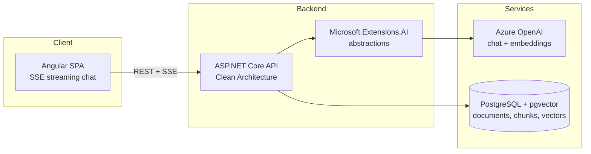

**English** · [Español](README.es.md)

# DocuMind

Chat with your documents — a RAG-powered knowledge assistant that answers questions about your PDFs with exact page citations.


## Why this project

Most document chatbots answer confidently but can't tell you *where* the answer came from. DocuMind is built around verifiable retrieval-augmented generation: every answer is grounded in the uploaded documents and cites the exact page it came from, so users can always check the source.

- Upload PDFs, ask questions in natural language.
- Streaming chat responses (SSE) with inline citations like `[report.pdf, p. 12]`.
- Clean Architecture backend designed to be provider-agnostic and testable.

## Project status

Phase 1 (MVP) is complete, built as two vertical slices:

- **Slice A — Ingestion (done, CI-verified):** PDF upload → per-page text extraction (PdfPig) → fixed-size chunking (~800 tokens, 15% overlap, page number preserved) → Azure OpenAI embeddings via `Microsoft.Extensions.AI` → persistence to PostgreSQL/pgvector. Includes the initial EF Core migration (vector extension + HNSW index), request validation (invalid-PDF → 400, upload size cap, empty-text warning), and unit tests.
- **Slice B — Chat + UI (done, demo-verified):** cross-document top-k retrieval ordered by pgvector cosine distance, a streaming `/api/chat` SSE endpoint with citations sourced from retrieved-chunk metadata, and a minimal Angular upload/chat UI. Retrieval `k` is a configurable, non-secret setting (`Retrieval:TopK`, default 5). The Azure OpenAI client pipeline is given an explicit retry policy (5 attempts, exponential backoff, honours `Retry-After`) so a rate-limited (429) chat call is retried rather than surfaced to the user — the chat deployment's quota is deliberately narrow for cost control, so 429s are expected under any real load.

Phase 2 (Auth & per-user documents) is complete, delivered as five pull requests each of which left `main` releasable on its own: Identity schema (deliberately inert) → auth endpoints and cookie/XSRF transport → client auth surface and route guard → per-user document ownership with owner-filtered retrieval → antiforgery enforcement on upload. Documents are no longer one shared collection: every document has an owner, retrieval and listing are scoped to the caller, and that isolation is proven on every commit by a Testcontainers integration test that asserts the query plan uses the HNSW index rather than merely returning plausible rows.

**Next**: a dedicated design slice for the Angular UI — the current one is functional but intentionally unstyled.

A hardening pass on top of Slice A moved Azure OpenAI configuration behind `dotnet user-secrets`, pinned out a high-severity transitive advisory in the OpenAPI dependency chain, and gave the Compose stack a fixed project name. `dotnet build` and `dotnet test` are clean: 0 warnings, 0 errors, 34/34 tests passing (29 unit, 5 integration).

## Architecture



## Tech stack

| Layer | Technology |
| --- | --- |
| Frontend | Angular (standalone components, Tailwind v4 utilities + spartan/ui (Helm) components on `@angular/cdk`, SSE streaming chat, client-side routing + auth guard) |
| Backend | ASP.NET Core on .NET 10 (C# 14), Clean Architecture |
| Auth | ASP.NET Core Identity — cookie auth + CSRF; `/api/documents` and `/api/chat` require it, retrieval and listing are scoped to the caller's own documents (see Key decisions) |
| AI | Azure OpenAI via Microsoft.Extensions.AI abstractions |
| Vector store | PostgreSQL + pgvector |
| Dev environment | Docker Compose |
| CI/CD | GitHub Actions (build + test on every push) |

## Key decisions and why

- **Azure OpenAI behind Microsoft.Extensions.AI** — the application depends on `IChatClient` / `IEmbeddingGenerator` abstractions, not on a concrete provider. Swapping Azure OpenAI for OpenAI, Ollama, or any other provider is a composition-root change, not a rewrite.
- **pgvector on PostgreSQL** — one database for both business data and vectors. No extra vector-store service to run, back up, or keep consistent; relational metadata and embeddings live side by side and can be joined in a single query.
- **Fixed-size chunking (~800 tokens, 15% overlap) with page metadata** — chunks carry the source page number, which is what makes exact page citations possible. Overlap protects against answers being split across chunk boundaries.
- **Restore locked to nuget.org** — a repo-root `NuGet.config` clears inherited sources and restores only from the public nuget.org feed, so a fresh clone builds identically anywhere and can't accidentally pull an internal or typosquatted package. (The official PdfPig package id is `PdfPig`, not `UglyToad.PdfPig`.)
- **Transitive vulnerabilities pinned at the top level** — `Microsoft.AspNetCore.OpenApi` 10.0.x declares an exact `Microsoft.OpenApi` 2.0.0 floor, and NuGet's lowest-applicable resolution then selects precisely that version, which carries a high-severity advisory (GHSA-v5pm-xwqc-g5wc). No release in the 10.0.x line raises the floor, so upgrading the parent package cannot fix it; the patched version is pinned explicitly instead, commented with the advisory id so the pin can be dropped once upstream moves. Same approach for `Microsoft.EntityFrameworkCore.Relational` and `Microsoft.Bcl.Memory`. The build is kept at zero warnings so a new advisory is visible the day it lands rather than lost in noise.
- **Retrieval MUST order by cosine distance, not just "a" distance** — the HNSW index is declared with the `vector_cosine_ops` operator class, and PostgreSQL only uses an index when the query's distance operator matches the index's operator class exactly. `EfChunkRepository` orders with `Pgvector.EntityFrameworkCore`'s `CosineDistance`, which translates to the `<=>` operator (confirmed by inspecting the generated SQL: `ORDER BY d."Embedding" <=> @queryVector`). Ordering by `L2Distance` (`<->`) instead would compile, run, and return plausible-looking results, but PostgreSQL would silently fall back to a full sequential scan on every query — no error, no warning, just a much slower query as the table grows. At the small row counts in this demo, PostgreSQL correctly prefers a sequential scan anyway; that is expected planner behaviour, not evidence the index is broken.
- **Azure OpenAI retries are explicit in the composition root** — `System.ClientModel`-based clients (which `AzureOpenAIClient` is) already default to a `ClientRetryPolicy` with exponential backoff and jitter that honours the `Retry-After` header, but that default is easy to miss and caps at 3 attempts. `DocuMind.Infrastructure`'s `DependencyInjection` constructs the retry policy explicitly (5 attempts) so the 429-handling behaviour is visible in code rather than assumed, and easy to tune. This matters here specifically: the chat deployment's token-per-minute quota is deliberately narrow for cost control, so 429s are an expected condition under load, not an edge case.
- **The API base URL is an Angular environment, not a hardcoded constant** — `ChatService` reads `environment.apiBaseUrl`. The `development` build configuration's `fileReplacements` swaps in `environment.development.ts` (`http://localhost:5092`, the API's local port); the default `environment.ts` used by production ships `''` on purpose — an empty base means every request resolves against the page's own origin, which is correct once the API is reachable at the same origin as the client or through a reverse proxy, and is not a placeholder someone forgot to fill in.
- **No credential literal in tracked configuration** — `appsettings.json` carries only non-secret deployment topology (the model deployment names); the Azure OpenAI endpoint and key, and the Postgres connection string, come from `dotnet user-secrets`, which stores them outside the working tree. The Compose stack reads its Postgres credentials from an untracked `.env`, declared *without* fallback defaults on purpose: a default in `docker-compose.yml` would still be a tracked credential, so it would move the value four characters to the right and fix nothing. Missing configuration fails loudly on both halves — Compose refuses to interpolate, and the API throws at startup with the exact command to run. `.gitignore` covers credential-shaped filenames as a safety net, not as the mechanism.
- **Hosting: Azure App Service + Neon** — managed app hosting plus serverless Postgres keeps the demo cheap to run and simple to deploy.
- **Identity's schema lands before any endpoint (Phase 2, PR1 of 5)** — `DocuMindDbContext` now also inherits `IdentityUserContext<ApplicationUser, Guid>`, and a migration creates the `AspNetUsers`/`AspNetUserClaims`/`AspNetUserLogins`/`AspNetUserTokens` tables. Nothing reads or writes them yet: no auth endpoint exists, no authentication/authorization middleware is registered, and no route requires it. This PR is deliberately inert — `main` stays functionally identical to before this dependency was added — so the schema change can be reviewed and merged on its own before the endpoints, cookie/XSRF transport, and per-user document ownership that depend on it land in later PRs. `ApplicationUser` lives in Infrastructure, not Domain: it derives from an Identity framework type, which makes it a persistence concern, and Domain never consumes it — ownership will be a bare `Guid` on the entity and the foreign key is configured in the DbContext. That is deliberately unlike the `Pgvector` reference in Domain above, which is forced rather than chosen: EF Core can only translate `CosineDistance` into SQL when the entity property is itself typed as a vector.
- **Auth endpoints and cookie/XSRF transport (Phase 2, PR2 of 5)** — `POST /api/account/register`, `POST /api/account/login`, `POST /api/account/logout`, and `GET /api/account/me` are built directly on `UserManager`/`SignInManager`, not `MapIdentityApi` (which defaults to bearer tokens — the wrong transport for a browser SPA). Cookie auth is registered explicitly as `IdentityConstants.ApplicationScheme` because `AddIdentityCore` alone does not register `SignInManager` (needs `.AddSignInManager()`) or wire up authentication at all. Two runtime-only defaults are overridden because they would otherwise silently break the client contract rather than fail to compile: `Events.OnRedirectToLogin`/`OnRedirectToAccessDenied` return `401`/`403` instead of a 302 to an HTML login page (an API must never redirect a `fetch` caller), and `PasswordSignInAsync` is called with `lockoutOnFailure: true` explicitly (the default value for that argument does not increment the lockout counter, which would make Identity's lockout protection aspirational rather than real). A non-`HttpOnly` `XSRF-TOKEN` cookie is issued proactively on every account response — including a `401` from `/me` — because Angular's antiforgery interceptor only ever echoes a cookie that already exists; it never fetches one. Antiforgery's own `HeaderName` is set to `X-XSRF-TOKEN` to match. CORS gains `.AllowCredentials()`, legal only because the origin list is an explicit non-wildcard value. Nothing yet requires authentication: `.RequireAuthorization()` is not applied to any existing endpoint, so `main` stays a fully working, unauthenticated app until per-user ownership lands in PR4.
- **Client auth surface (Phase 2, PR3 of 5)** — the app's first real route table: `/login`, `/register`, and a guarded `/` behind a functional `authGuard`. Cookie auth carries no client-readable claims, so `AuthService.ensureBootstrapped()` calls `GET /api/account/me` once per app load (deduped across concurrent navigations, via a cached in-flight promise) before the guard decides anything. `provideHttpClient` now states `withXsrfConfiguration({ cookieName: 'XSRF-TOKEN', headerName: 'X-XSRF-TOKEN' })` explicitly, matching the server's `AntiforgeryOptions.HeaderName` on purpose rather than by luck. A dedicated `apiInterceptor` runs alongside it: Angular's own XSRF interceptor compares the request's origin to the *page's* origin and does nothing when they differ (verified against the installed `@angular/common` v22.0.7 source, not assumed), and in development `environment.apiBaseUrl` (`http://localhost:5092`) is exactly a different origin from the Angular dev server (`http://localhost:4200`) — so without this interceptor, the moment PR5 removes `.DisableAntiforgery()`, the dev upload would fail antiforgery validation in a way that reads as a server bug. It no-ops in production, where `apiBaseUrl` is `''` and every request is same-origin, so Angular's built-in behaviour already suffices. `ChatService.ask()` uses raw `fetch`, which bypasses every Angular interceptor: it now sends `credentials: 'include'` (its default, `'same-origin'`, would silently drop the cookie across the `:4200`→`:5092` dev boundary) and reads/attaches `X-XSRF-TOKEN` itself from `document.cookie`. A 401 on `/api/chat`'s *initial* request (a mid-stream 401 cannot happen — the HTTP status commits before SSE streaming begins) now surfaces a visible message and redirects to `/login` through the same `AuthService` the guard uses, instead of becoming an unhandled rejection. Nothing on the server enforces authentication yet (that lands in PR4): confirmed by running the API against the live Postgres container end to end — register → cookie-authenticated `/me` → CORS preflight for the `:4200` origin with credentials allowed → logout → `/me` returns `401` again → unauthenticated `/api/chat` still streams `200`, proving `main` still serves upload and chat exactly as before.
- **Ownership + filtered retrieval (Phase 2, PR4 of 5)** — every `Document` now has an authoritative `OwnerId` (uuid, `NOT NULL`, FK to `AspNetUsers.Id` with `ON DELETE RESTRICT` — deleting an account must not silently destroy that account's documents, chunks, and embeddings; there is no account-deletion flow yet, which is exactly why `Restrict` and not `Cascade` matters here, tracked as a Known follow-up below). `DocumentChunk` also carries its own `OwnerId`, deliberately denormalized rather than resolved via a join: the HNSW index lives on `document_chunks`, so filtering by owner through `documents` would place the predicate *above* the ordered index scan as a semi-join — the least predictable plan shape available, and the same "compiles, runs, silently wrong plan" class this project has already been bitten by once (see the cosine-operator note above). The two columns cannot drift apart by accident: `documents` gains an alternate key on `(Id, OwnerId)`, and `document_chunks`' foreign key becomes composite — `(DocumentId, OwnerId) → documents (Id, OwnerId)`, `ON DELETE CASCADE` — so the database rejects any chunk row whose owner disagrees with its own document's, rather than relying on every write path to get it right. The migration that adds these `NOT NULL` columns starts with `DELETE FROM document_chunks; DELETE FROM documents;` in the same `Up()` — combining the truncate and the column addition in one migration (rather than two) means a fresh clone applying every migration in order reproduces the same schema a hand-truncated environment gets, and a document uploaded between two separate migrations can never make the second one fail; `Down()` cannot undo the deletion, and says so loudly in the migration's XML comment. `IChunkRepository.SearchAsync` now takes `ownerId` as its first, required parameter — not an optional one appended last with a default, which would compile everywhere unchanged and silently preserve the exact unfiltered query this change exists to remove — and `EfChunkRepository` filters `document_chunks` by it before the `ORDER BY`, keeping the single-table predicate on the same relation the index lives on. That filter depends on a runtime setting that is easy to omit on a fresh clone: the Postgres connection string must carry `Options=-c hnsw.iterative_scan=strict_order` (see Getting started), because pgvector's HNSW index otherwise applies the owner filter *after* the ordered scan and can silently return fewer than the requested number of results instead of continuing — a startup check (`RetrievalPrerequisiteCheck`, run once after the app builds and before it starts serving) queries the running connection directly and **throws** if that setting is missing or if the installed `vector` extension predates 0.8.0 (the version iterative scans shipped in; the `pgvector/pgvector:pg17` image tag floats, so this is re-checked every start, not just once). `POST /api/documents`, `GET /api/documents` (new — lists only the caller's own documents, and never returns the owner field), and `POST /api/chat` all now carry `.RequireAuthorization()`. The owner-isolation guarantee is proven by an automated Testcontainers integration test, not a manual transcript, because it is a security property that must hold on every commit: it seeds 3 users × 3 documents each with ~5,000 chunks using analytically placed embeddings (so the exact expected top-k ranking is known in advance, not just plausible-looking), captures the *actual* SQL `EfChunkRepository.SearchAsync` issues, re-runs it as `EXPLAIN ANALYZE` to confirm PostgreSQL chose the HNSW index scan rather than a sequential scan, and asserts the returned rows belong exclusively to the querying owner. This is the one place `dotnet test backend/DocuMind.slnx` now needs Docker running locally, in addition to the Compose Postgres — `ubuntu-latest` ships Docker already, so CI needed no workflow changes. `.DisableAntiforgery()` on `/api/documents` stays exactly as it was for one more PR: the endpoint is authenticated now, so the original justification (no ambient session to forge) no longer holds, but removing the call depends on the Angular-absolute-URL interceptor fix that PR3 already shipped for exactly this reason — the removal itself, and the CSRF-asymmetry rationale for `/api/chat`, land together in PR5.
- **Antiforgery enforced on upload, deliberately absent on chat (Phase 2, PR5 of 5)** — `.DisableAntiforgery()` is gone from `POST /api/documents`, and the *absence* of that call is the whole mechanism: minimal APIs attach antiforgery metadata automatically to any endpoint binding `IFormFile`, so the endpoint demands a valid token by default and the only way to weaken it is to add a call back. `POST /api/chat` gets no such filter, and that asymmetry is a decision rather than an omission. A cross-origin HTML form can submit `multipart/form-data` with the session cookie attached and no CORS preflight — that is exactly the classic CSRF shape, and it is why the upload endpoint needs a token. The same form *cannot* set `Content-Type: application/json`, which is the only content type `/api/chat` accepts; a JSON request therefore forces a CORS preflight, which an explicit non-wildcard origin list rejects, and the `SameSite` cookie scoping never attaches the session in the first place. Adding a token requirement there would defend against nothing while breaking the raw `fetch` the SSE stream depends on. Both halves are pinned as assertions in `EndpointSecurityMetadataTests`, which reads the metadata ASP.NET Core actually builds for each endpoint, because a security property expressed as an absence is invisible to every other test in the suite and to a reviewer skimming a diff: re-adding one call would compile, keep all other tests green, and silently remove CSRF protection from the only state-changing multipart endpoint in the app. Two details are worth recording because both were verified rather than assumed. First, `DisableAntiforgery()` does not remove the metadata — it adds an entry whose `RequiresValidation` is `false`, so asserting the metadata is merely *present* would pass even with protection off; the assertion targets the property. Second, the test was confirmed to fail by temporarily re-adding the call, because a security test never observed failing is decoration. Enforcement was only safe to switch on because PR3 already shipped the `apiInterceptor` that attaches the token to cross-origin dev requests (ADR-J): without it, this change would have broken every local upload in a way that reads as a server bug. Revisit if `/api/chat` ever accepts a form, or if the CORS origin list ever gains a wildcard — either would invalidate the reasoning above rather than the assertions.
- **Tailwind v4 + spartan/ui (Helm) foundation, zero component stylesheets (ui-redesign, PR1 of 5)** — the Angular client's design pass lands as five sequential commits on top of the previous slice's SCSS-to-CSS conversion. This first commit adds the toolchain only: Tailwind v4 via `@tailwindcss/postcss` (auto-discovered through a new `.postcssrc.json`), the `spartan/ui` (Helm) component library on `@angular/cdk`, and a single global `src/styles.css` carrying both a light and a dark design-token set — dark ships as the default (`<html lang="en" class="dark">`); a visible theme toggle is out of scope for now. Angular's default emulated encapsulation had already scoped seven of the app's eight legacy component-style rules to a template that never used them (confirmed by reading every file, not assumed); deleting the one remaining rule and porting its live effect — `.app-shell`'s centring — to Tailwind utilities on `<main>` costs nothing beyond this commit. One visible side effect worth naming rather than discovering later: Tailwind's reset (`preflight`) removes the browser's own default `button`/`input`/heading styling before the components that will replace it exist, so the app looks visibly unstyled between this commit and the restyle commits that follow later in this slice — a deliberate, accepted, time-boxed tradeoff, not a regression to fix here. The streaming cursor's `blink` keyframe (dead on arrival, and confirmed dead again here) is ported to a reusable `animate-blink` Tailwind utility in this same stylesheet; it starts actually rendering only once a later commit in this slice applies it to the chat template.
- **Cancellation and honest upload-rejection reasons (ui-redesign, PR2 of 5)** — two behaviour-only fixes, no visual restyle. `ChatService.ask()` now creates a per-request `AbortController` and exposes `stop()`. A new `outcome?: 'complete' | 'stopped' | 'failed'` field on `ChatMessage` records how a turn ended; it is set only through the service's existing `patchAssistantMessage` helper, never on the user turn, so the pre-existing zero-diff contract on `chat.service.spec.ts` holds unchanged (verified against `main`, not assumed) — cancellation tests live in a new `chat.service.abort.spec.ts` instead. Abort detection reads `controller.signal.aborted` rather than `error.name === 'AbortError'`, because a rejection surfacing from the SSE reader is not guaranteed to carry that name across fetch implementations and jsdom. Stopping mid-stream keeps the partial answer, clears `isStreaming` through the same `finally` that already ran on completion and failure, and no longer rethrows into `Chat.ask()`'s `catch` — which previously repainted a deliberate Stop as "Failed to get an answer. Is the API running?". A stale controller from an already-finished request can never abort a later one: `ask()`'s `finally` clears the field, guarded by identity so a slow-finishing request cannot clear a newer request's controller either. Separately, `Upload` now surfaces the API's actual rejection reason (invalid PDF, empty file, oversized file) through a new pure `uploadErrorMessage()` function, reserving the generic "Is the API running?" message for the one case it actually describes: no response received at all (`status === 0`).
- **Two-pane shell and sources panel (ui-redesign, PR3 of 5)** — the app's authenticated route (`AppShell`, formerly `Home`) becomes a sidebar-plus-conversation layout, side by side at 1024px and above, collapsing to an off-canvas drawer below that. The sidebar (`SourcesPanel`, a new feature) lists the caller's own documents — file name, page count, upload date only, no chunk count, no owner — through a new `DocumentsService` (`GET /api/documents`, the first client consumer of that endpoint), rendering a distinct empty state on first run and refreshing after every successful upload. Upload moves into the sidebar as a presentational `UploadControl`; `SourcesPanel` performs the upload call and the refresh, while `uploadDocument` itself stays on `ChatService` — moving it would touch the highest-regression-risk file in the client for no user-visible benefit. Five spartan/ui (Helm) primitives land this slice (`button`, `card`, `separator`, `sheet`, `skeleton`), copied into `src/app/ui/**` and owned in-repo; the mobile drawer is the first place `@angular/cdk`'s Overlay, Dialog, and A11y modules — and `@angular/cdk/layout`'s `BreakpointObserver`, for the desktop/drawer split itself — actually ship in the bundle, which is why the initial bundle grows from 252.88 kB to 453.88 kB raw (68.33 kB to 115.73 kB estimated transfer) in this one commit; both figures stay comfortably under the 500 kB build-time warning. `App`'s shared `<main>` wrapper drops its `max-w-[640px]` centring — needed for the shell to use the full viewport — which incidentally affects `/login` and `/register` too, but both already carry zero Tailwind classes of their own (PR5 restyles them), so nothing they relied on is lost.

## Getting started

Prerequisites: .NET 10 SDK, Node.js 22+, pnpm, Docker.

The `Options=-c hnsw.iterative_scan=strict_order` fragment in step 3 below is required, not
optional (Phase 2, PR4): retrieval filters `document_chunks` by owner before the HNSW ordered
scan, and without this setting on the connection PostgreSQL can silently return fewer results
than requested instead of continuing the scan. The API asserts this setting (and that the
installed `vector` extension is >= 0.8.0) once at startup and refuses to start if either check
fails — a fresh clone that omits the fragment gets a loud, actionable error instead of a silent
under-return at query time. `dotnet test backend/DocuMind.slnx` now also starts its own disposable
Postgres container (Testcontainers) for the owner-isolation integration test, so Docker must be
running locally for the backend test suite, in addition to the Compose Postgres above.

```bash
# 1. Create the local environment file. It carries the throwaway credentials for
#    the dev Postgres container and is not tracked. Compose fails with an
#    explicit message if it is missing.
cp .env.example .env

# 2. Start PostgreSQL with pgvector
docker compose up -d

# 3. Supply the API's secrets. They live in user-secrets, outside the working
#    tree, so they are never committed. The UserSecretsId is already declared in
#    DocuMind.Api.csproj, so there is nothing to initialise. The connection
#    string must match the credentials in .env — see the note in .env.example.
cd backend/src/DocuMind.Api
dotnet user-secrets set "ConnectionStrings:Postgres" "Host=localhost;Port=5432;Database=documind;Username=documind;Password=documind_dev;Options=-c hnsw.iterative_scan=strict_order"
dotnet user-secrets set "AzureOpenAI:Endpoint" "https://<your-resource>.openai.azure.com/"
dotnet user-secrets set "AzureOpenAI:ApiKey" "<your-key>"

# 4. Run the API
dotnet run

# 5. Run the Angular client
cd ../../../client
pnpm install
pnpm start
```

The model deployment names ship as checked-in defaults in `appsettings.json`
(`text-embedding-3-small` for embeddings, `gpt-5-mini` for chat) because they are
deployment topology, not credentials. Override them the same way as the secrets
above if your Azure deployments are named differently:

```bash
dotnet user-secrets set "AzureOpenAI:EmbeddingDeployment" "<your-embedding-deployment>"
dotnet user-secrets set "AzureOpenAI:ChatDeployment" "<your-chat-deployment>"
```

The number of chunks retrieved per question (`Retrieval:TopK`, default 5) is also a
checked-in, non-secret default in `appsettings.json` — override it the same way if needed:

```bash
dotnet user-secrets set "Retrieval:TopK" "8"
```

## Branching and releases

| Branch | Role |
| --- | --- |
| `main` | Always releasable. Protected: no direct pushes, changes arrive by pull request with CI green. |
| `production` | What is deployed. Fast-forwarded from `main` at release time, never committed to directly. |
| `feat/*`, `fix/*`, `chore/*`, `docs/*` | Short-lived, one work unit each, deleted after merge. |

Commits follow [Conventional Commits](https://www.conventionalcommits.org/). That is what lets
the changelog be assembled from history instead of maintained by hand, and it is why the commit
type is not decoration. Branch prefixes deliberately reuse the same vocabulary — `feat/`, not
`feature/` — so a branch name and the commits on it cannot disagree about what kind of change it
carries.

Releases are [semantic versions](https://semver.org/) tagged on `main` as `vMAJOR.MINOR.PATCH`,
recorded in [CHANGELOG.md](CHANGELOG.md), and promoted by fast-forward so `production` can never
contain a commit that `main` has not seen:

```bash
git switch production && git merge --ff-only main && git push origin production
```

Before 1.0 the minor version marks a completed phase and the patch version marks fixes within it.

**Why not Git Flow.** Its `develop`/`release`/`hotfix` layering exists to maintain several
released versions in parallel. This project ships a single version continuously, so those
branches would add ceremony without answering a question the project actually has — a point its
own author has since made about continuously delivered software.

## Roadmap

- [x] **Phase 1 — MVP**: PDF upload, chunking + embedding pipeline, streaming chat with exact page citations.
- [x] **Phase 2 — Auth & collections**: user accounts, cookie authentication with CSRF protection, and per-user document ownership enforced in the schema, the type system, and the route table. Named collections within a user's documents remain a separate, later slice.
- [ ] **Phase 3 — Quality**: conversation history, retrieval re-ranking, answer evaluation harness, semantic answer cache.
- [ ] **Phase 4 — Production**: broader test suite, CI/CD, public demo deployment.

### Known follow-ups

- [ ] **Drop the `Microsoft.OpenApi` pin** once `Microsoft.AspNetCore.OpenApi` raises its dependency floor above the patched version, at which point the pin is redundant.
- [ ] **Design pass on the Angular UI.** The upload/chat components are deliberately minimal and unstyled — functional for the demo, not representative of the intended product design. Due once a dedicated design slice is scheduled.
- [ ] **Semantic answer cache.** Deliberately deferred out of Slice B — it needs a new table and lookup path, which would have mixed an unrelated concern into the chat implementation. Due whenever repeat-question latency/cost becomes a measured problem worth solving.
- [ ] **`Collection` entity — named collections within a user's documents.** Phase 2 delivered per-user *ownership*: every document belongs to one account, and retrieval is scoped to the caller. It did not deliver collections a user can name and organise documents into, which the Phase 2 roadmap item's wording ("per-user document collections") could be read as promising. Flat ownership was chosen deliberately — a `Collection` entity would have added a second scoping dimension to every query and index decision while ownership itself was still unproven. Due when a user has enough documents that one flat list stops being navigable, which is a product signal rather than a technical one.
- [ ] **Pin the `pgvector` image tag.** `docker-compose.yml` and the Testcontainers fixture both use `pgvector/pgvector:pg17`, a floating tag. A rebuild can therefore silently move the installed `vector` extension version, and Phase 2's owner-filtered retrieval depends on that version being at least 0.8.0 for iterative scans — which is precisely why `RetrievalPrerequisiteCheck` re-asserts it on every start rather than once. That check turns a silent regression into a loud one, but it does not prevent it. Due before any deployment that cannot tolerate an unplanned database-image change; pinning to a digest is the fix, and the startup assertion stays either way as the backstop.
- [ ] **Account-endpoint tests through HTTP.** `AccountIdentityBehaviourTests` verifies Identity's duplicate-email, wrong-password, and lockout behaviour against a real database, including that the correct password is refused while an account is locked. It supplies `lockoutOnFailure: true` itself, though, so it cannot catch that argument being flipped to `false` at the login endpoint's call site — nor can it assert which cookies a failed login does and does not set, which is an HTTP-level property. Due if the account endpoints gain more behaviour than the current four, at which point a `WebApplicationFactory` harness pays for itself; the reason one does not exist yet is that booting the app in tests drags in the Azure OpenAI configuration and the startup retrieval assertion, both of which need deliberate overriding.
- [ ] **Account deletion.** `documents.OwnerId`'s foreign key to `AspNetUsers` is `ON DELETE RESTRICT` on purpose (Phase 2, PR4): deleting an account must not silently destroy that account's documents, chunks, and embeddings. There is no account-deletion flow yet, so this is currently latent rather than exercised. Due once such a flow is introduced — it needs an explicit decision (block the deletion while documents exist, or cascade-delete the documents deliberately) rather than inheriting whatever `Restrict` happens to do today.
